# F0 · Lab setup (Azure foundation)

**Started:** 1 Oct 2026
**Status:** Azure build done. The break/fix part has to wait until there's a server to connect to (F2).

## The request

> **REQ-0001** · From: Megan Doyle, Operations Manager, Kestrel Freight (fictional)
>
> We've signed up for Azure. Before anyone builds a server I want two things: no surprise bills, and a setup someone else could walk into and understand. Admin access must not be open to the internet, and keep all the IT notes in one place a contractor could follow. We're 40 people in Canberra now with a Sydney warehouse coming next year, so don't paint us into a corner.

Basically, before building anything useful I had to set up the boring-but-important stuff: a spending limit, somewhere organised to put things, a network, and a safe way in.

## What I built

| What | Name | Notes |
|------|------|-------|
| Budget alert | `budget-kestrel-lab-monthly` | A$50/month. Emails at 50%, 80% and 100% of actual spend, plus 100% forecast |
| Resource group | `rg-kestrel-core-aue` | Australia Southeast, tagged, with a delete lock |
| Delete lock | `lock-kestrel-core-nodelete` | Stops anyone deleting the group (or what's in it) by accident |
| Virtual network | `vnet-kestrel-ause` | 10.10.0.0/16 |
| Subnets | `snet-servers`, `snet-clients` | 10.10.1.0/24 and 10.10.2.0/24 |
| Network security group | `nsg-kestrel-ause` | Remote desktop allowed from my home IP only. Attached to both subnets |
| Repo | `kestrel-it-lab` | This one |

Naming and IP details are in [docs/standards](../../docs/standards/).

## How I did it

### 1. Starting point

The subscription had some charges from September for an older lab (disks and a public IP, about A$28). Those resources were already gone, so I checked **All resources** to make sure I was starting from nothing.

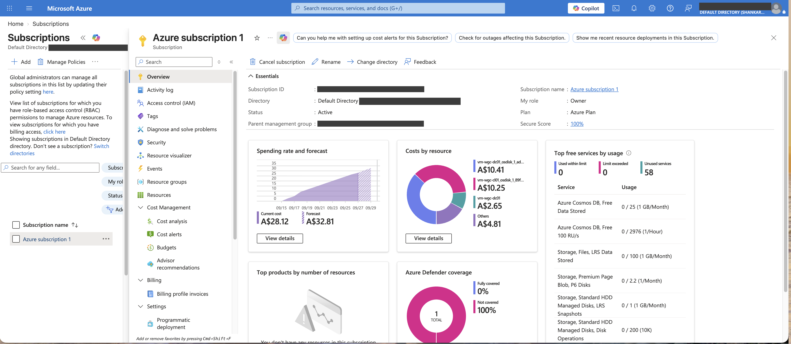
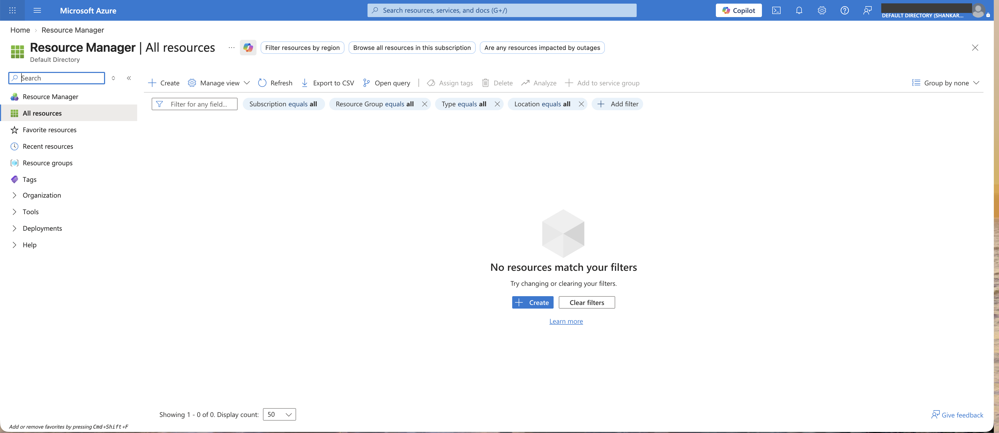

Those September costs were actually a good lesson before I'd built anything: disks and public IPs keep charging even when the VM isn't running.

### 2. Budget alert

Set a monthly budget of A$50 with four alerts. The first three tell me when money has already been spent. The fourth one (forecast) warns me if Azure thinks I'm *going to* go over by the end of the month, which is the one that actually gives you time to do something about it.

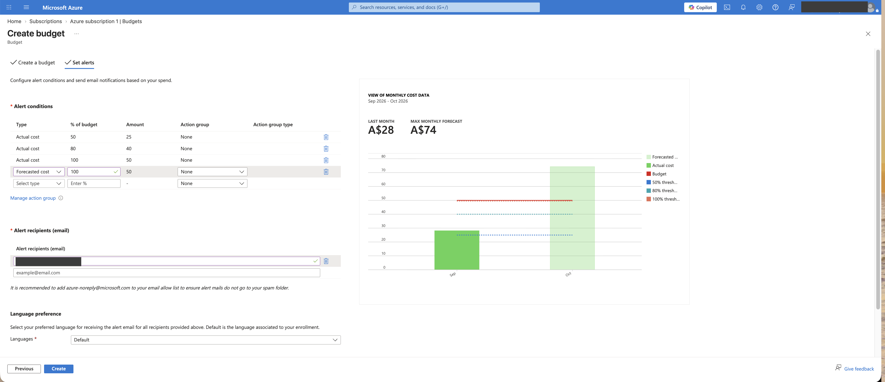
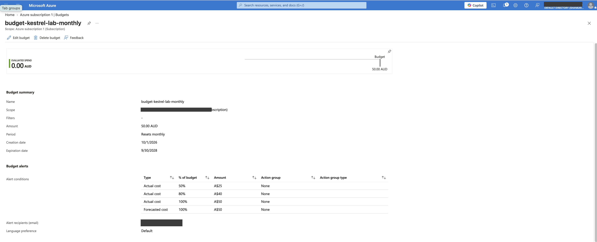

Interesting thing: when I made the budget, Azure was forecasting A$74 for October, based on September's spending from the old lab. So I might get a forecast alert early in the month even though I've spent nothing. That should settle once October's real numbers come through.

Also worth knowing: a budget is a **warning, not a hard stop.** It emails you, it doesn't switch anything off.

### 3. Resource group and delete lock

Everything for Kestrel's core setup goes in one resource group, so it's easy to find and easy to see the cost of.

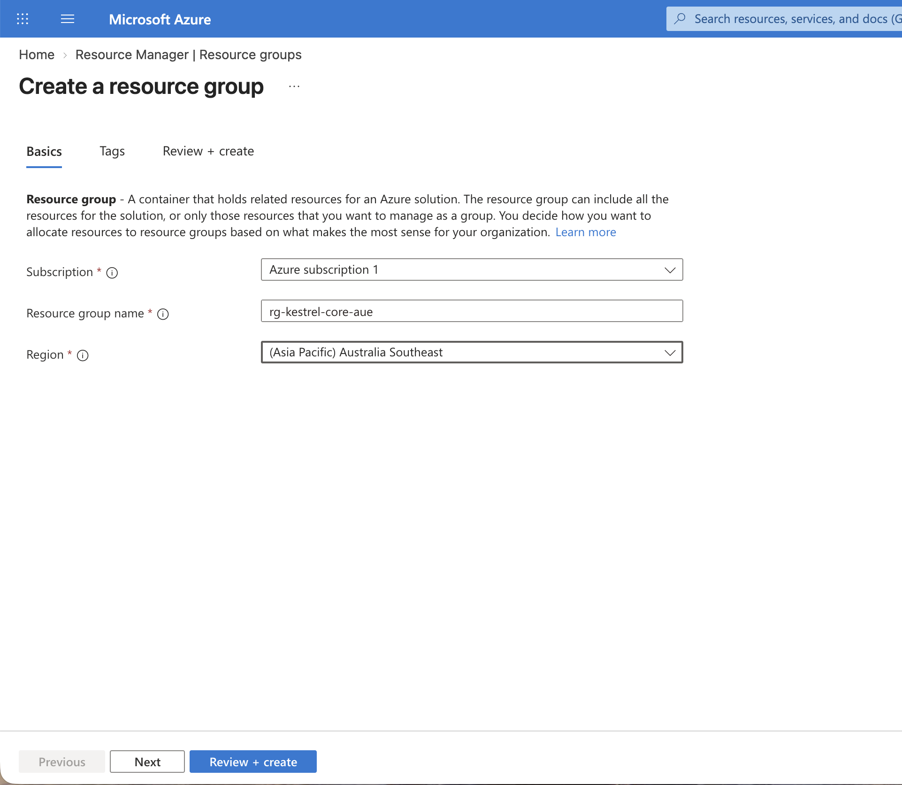
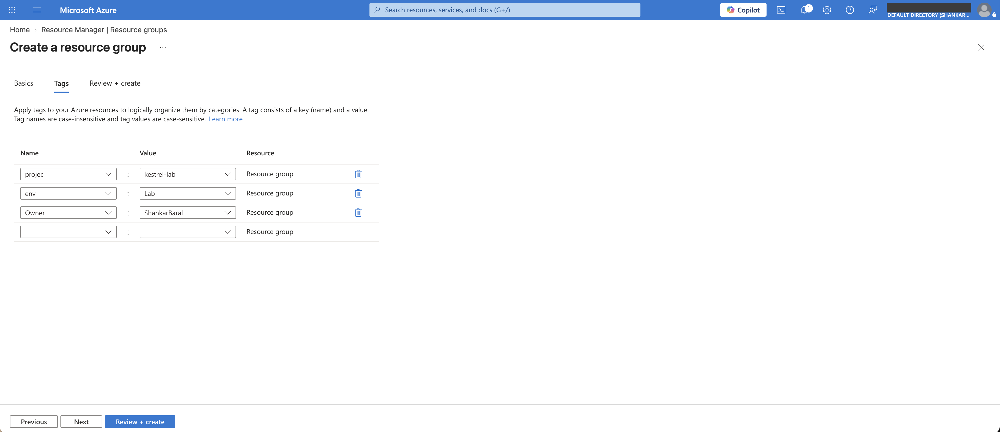
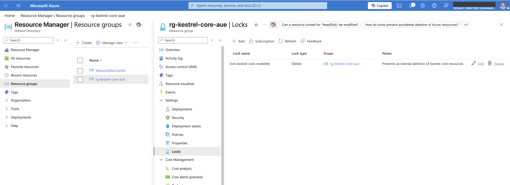

### 4. Virtual network and subnets

One network for the "office" (10.10.0.0/16) split into two subnets: one for servers and one for staff PCs.

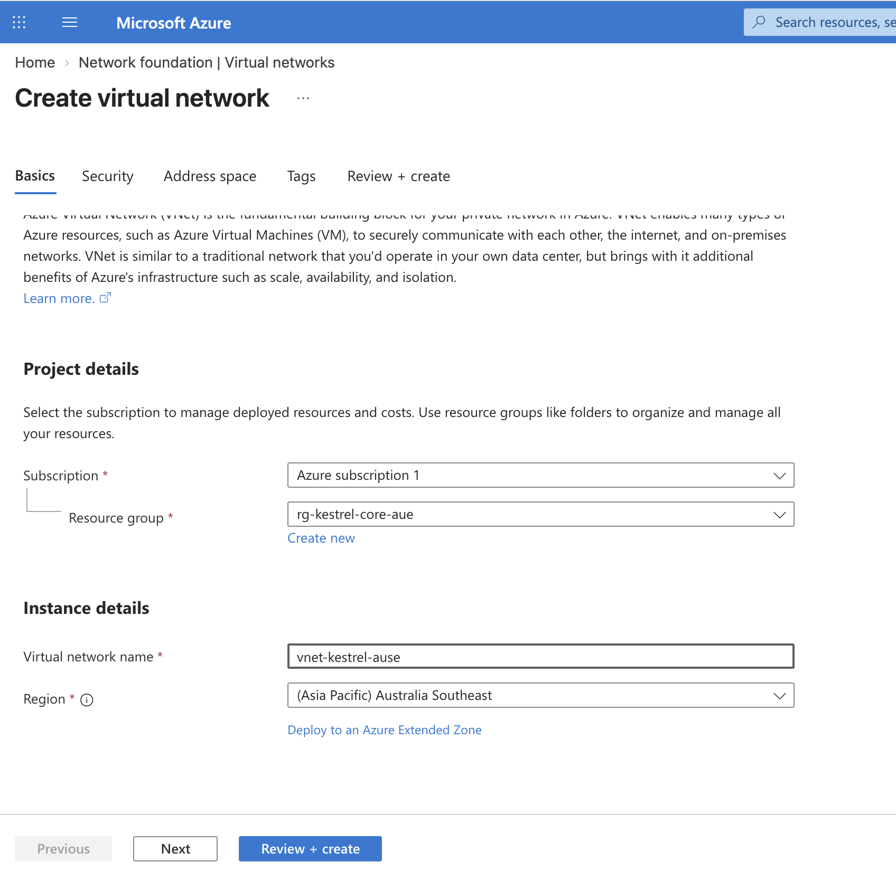
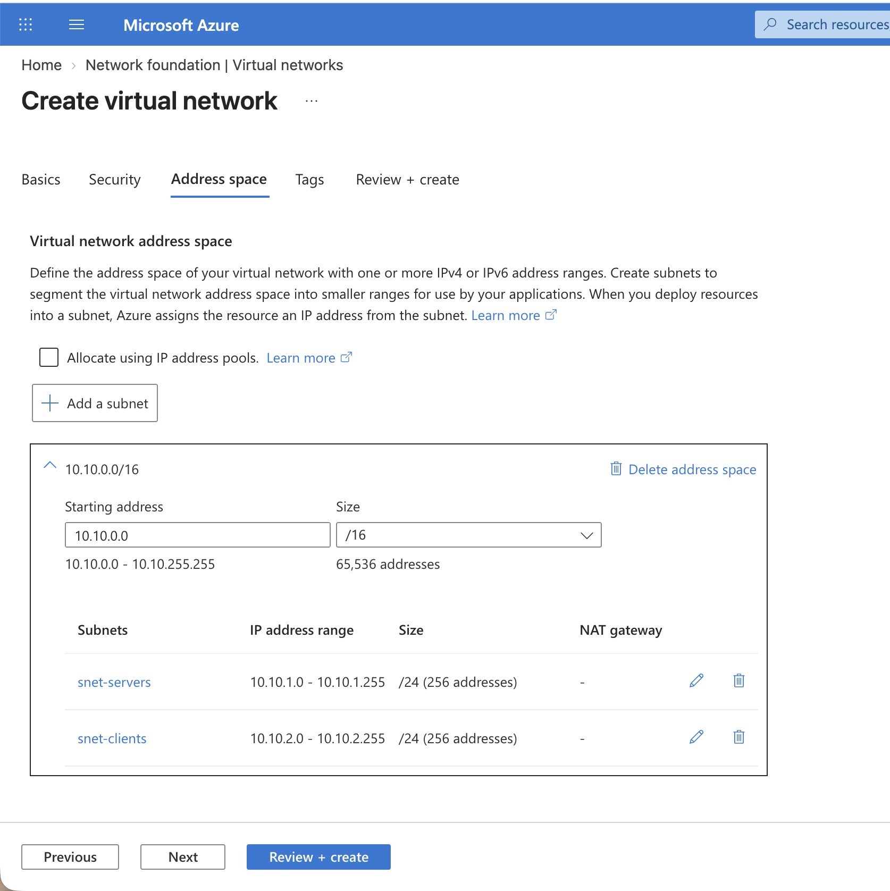
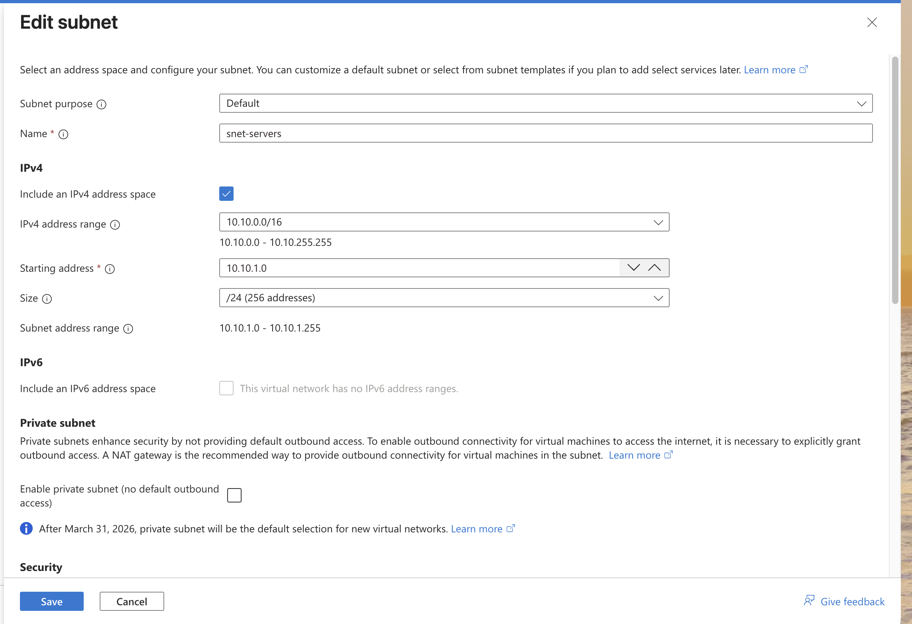
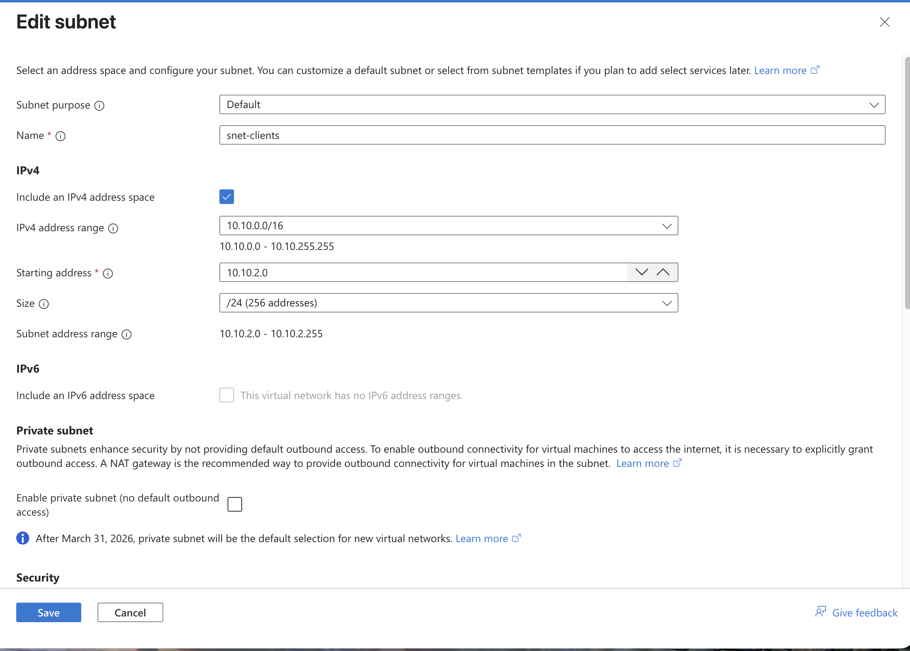

I turned **private subnet off** for both. Since March 2026 new subnets default to "private", which means VMs get no internet access unless you add a NAT gateway. For a real company, private subnet plus a NAT gateway is the better setup. But a NAT gateway costs around US$30+ a month on its own, and without internet the server can't get Windows updates or activate. For a lab I went with default outbound access and I'm noting it here so it's a conscious choice, not a mistake.

### 5. Network security group (the front door)

A new NSG comes with three default rules. The important one is **DenyAllInBound** at the bottom, which blocks everything from outside that isn't specifically allowed.

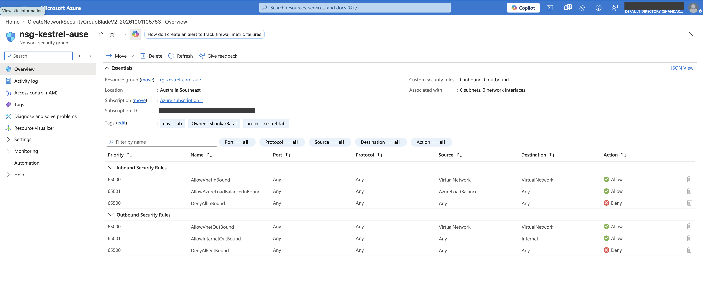

I added one rule above it: allow RDP (port 3389) but only from my home IP, priority 100. Rules are checked from the lowest number up and the first match wins, so my IP gets in and everyone else falls through to the deny rule.

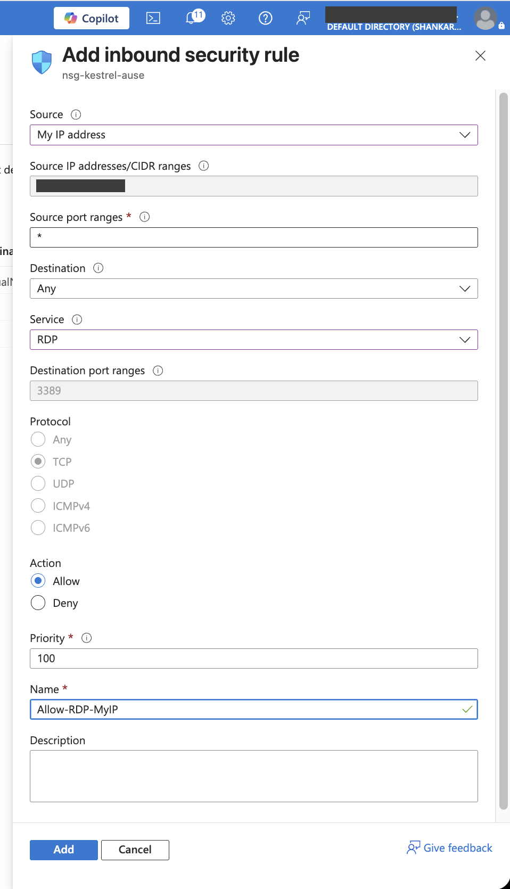
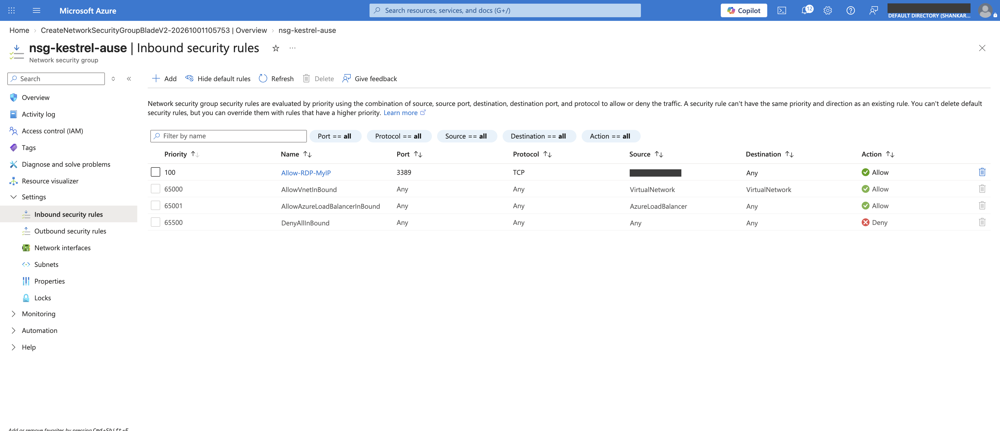

Then attached the NSG to both subnets. An NSG on its own doesn't protect anything until it's associated with a subnet or a network card.

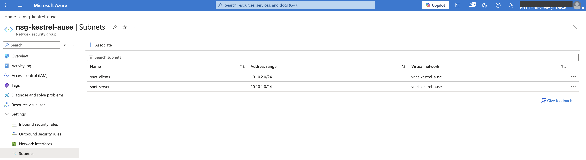

I used one NSG for both subnets to keep it simple. A bigger company would probably give servers their own stricter one.

### 6. GitHub repo

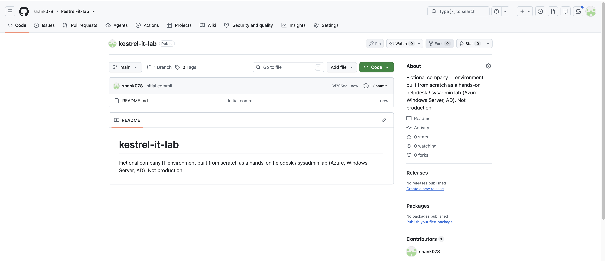

## Testing

| Check | Result |
|-------|--------|
| Budget shows 4 alerts and A$0 spent | ✅ Pass |
| Delete lock is on `rg-kestrel-core-aue` | ✅ Pass (after fixing, see below) |
| VNet is 10.10.0.0/16 with both subnets | ✅ Pass |
| RDP rule source is my IP, not "Any" | ✅ Pass |
| NSG attached to both subnets | ✅ Pass |
| RDP actually connects from home and is blocked from anywhere else | Not tested yet. Needs a VM, so this happens in F2 |

## Things that went wrong 😅

**1. I cancelled the whole subscription by accident.** Full write-up here: [incident-01-subscription-cancelled.md](incident-01-subscription-cancelled.md). Short version: "Cancel subscription" sits right next to "Rename" on the subscription page. Got it back to Active, nothing was lost.

**2. The delete lock first went on the wrong resource group.** I added it to an old group from a previous lab instead of the Kestrel one. Moved it to the right group. Lesson: check the page title before you change anything.

**3. The VNet nearly got created with Azure's default addresses (10.0.0.0/16).** It said "Validation passed", but that only means the settings are valid, not that they're the ones I wanted. I also typed "10.0.0.0 - 10.10.0.0" into the starting address box at one point and got a "malformed address" error, because that box only takes one address. The /16 next to it sets the size.

**4. Small typos in the tags.** I typed `projec` instead of `project`, and used `Lab` instead of `lab`. Tag values are case-sensitive, so `Lab` and `lab` would show up as two different things in a cost report. I've left them for now and noted the correct standard in [naming-and-tagging.md](../../docs/standards/naming-and-tagging.md).

## Known differences from the plan

- The plan was Australia East, but I went with **Australia Southeast**. The resource group name still ends in `-aue` because resource group names can't be changed after they're created. Everything new uses `-ause`.
- Tag typos as above.
- Private subnet turned off on purpose (cost).

## Break/fix (still to do)

The plan for F0's break/fix: my home IP changes (ISPs do this), the RDP rule stops matching, and I get locked out. I'll work out why from the symptoms and fix the rule. It needs a VM to connect to, so I'll do it once the domain controller is up in F2 and add the write-up here.

## What I took away from this

- Costs in Azure keep going in places you don't expect (disks, IPs), so "the VM is off" doesn't mean "it's free".
- A forecast alert is more useful than an actual-cost alert because it warns you while there's still time.
- "Validation passed" doesn't mean "correct". Read the summary before clicking Create.
- Default deny + one specific allow rule is how you open exactly one door for exactly one person.
- Locks protect resources, but they don't stop someone cancelling the whole subscription. That's a billing permission thing.

## Cost

A$0. Nothing built in F0 is charged (resource groups, VNets, subnets, NSGs and budgets are all free).

## Next

F1: setting up a ticketing system, so every fault from here on gets logged properly. Then F2: Kestrel's first server, the domain controller.
