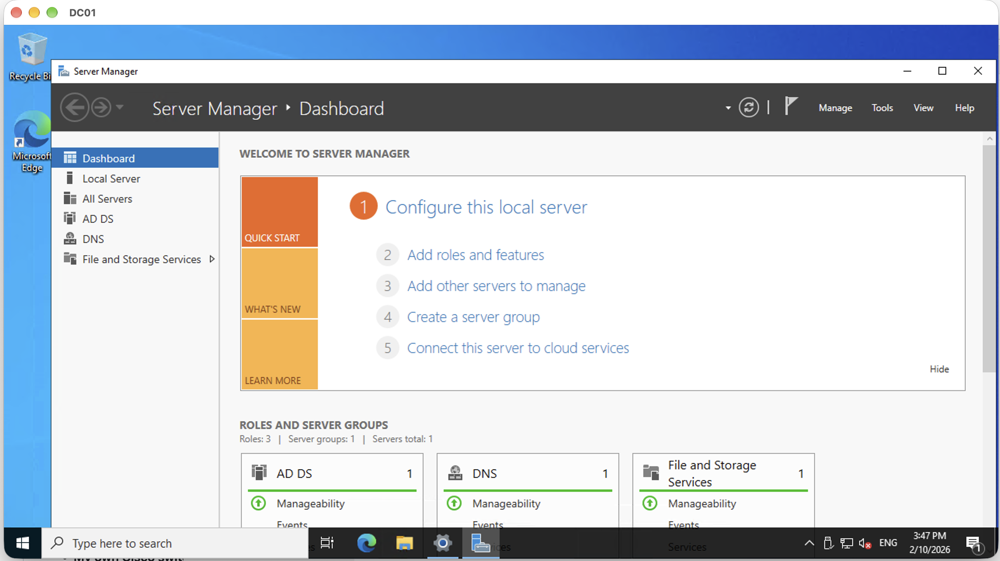
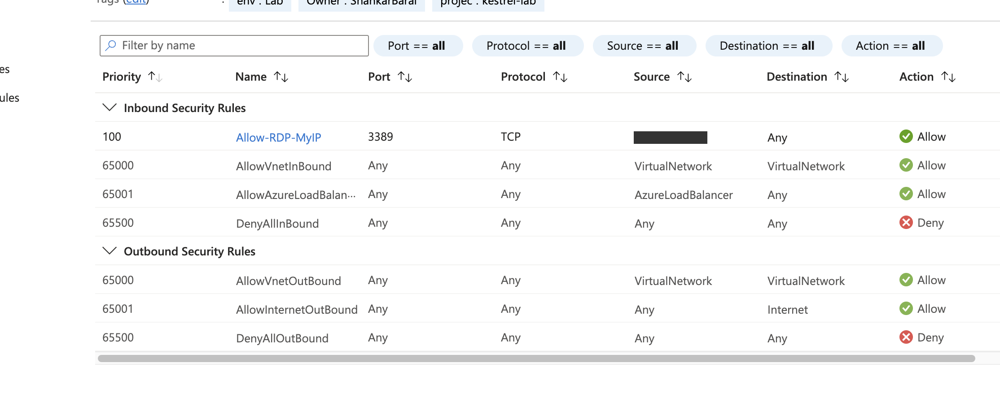
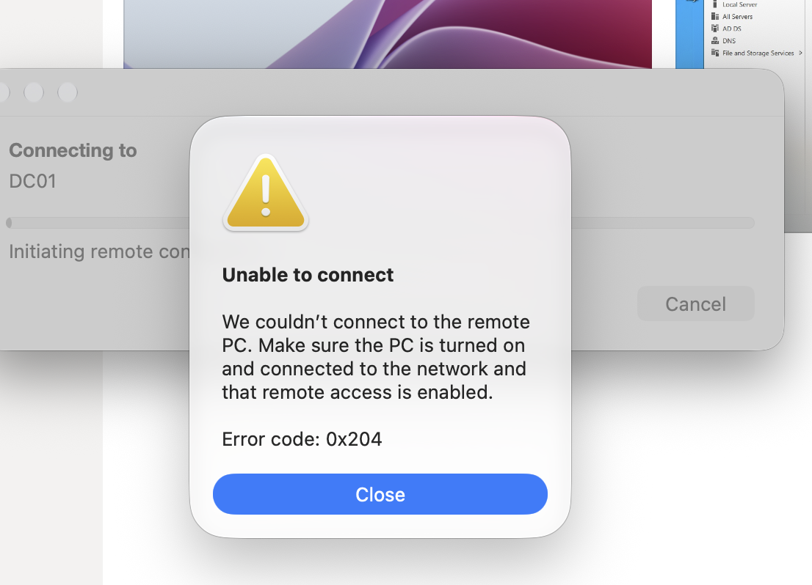
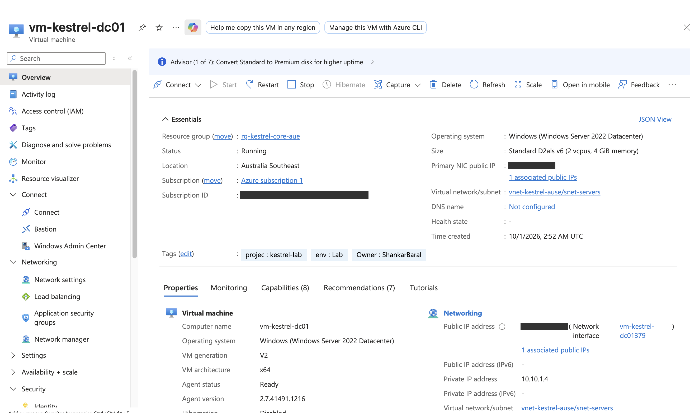
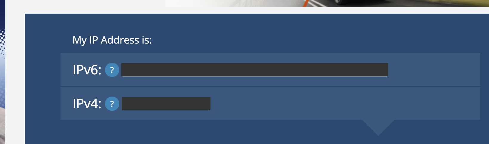
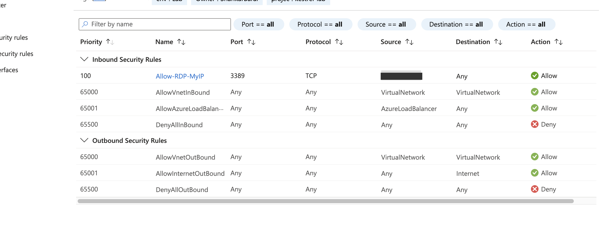
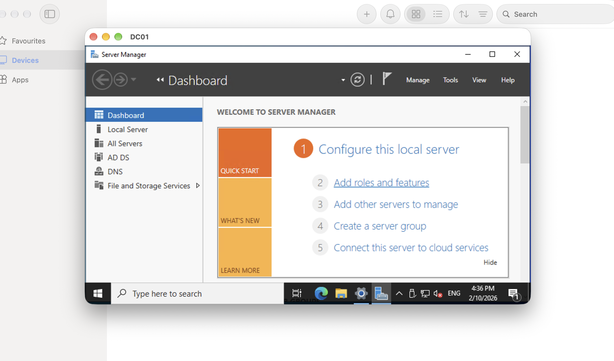

# INC-0003 · Can't RDP to the domain controller

| | |
|---|---|
| **Date** | 2 Oct 2026 |
| **Raised by** | Megan Doyle, Operations Manager (fictional) |
| **Affected** | Admin access (RDP) to `vm-kestrel-dc01`. Staff logons weren't affected |
| **Priority** | P2 |
| **Status** | Resolved |
| **Type** | Planned break/fix exercise. I made the fault on purpose, then worked it from the symptoms |

## The ticket

> Hi, our IT contractor says he can't get into the server this morning to do the weekly checks. He says it worked fine yesterday and nothing's been changed. Staff logins seem fine. Can you find out what's going on?

## Baseline (before the fault)

The NSG rule `Allow-RDP-MyIP` (priority 100) allowed TCP 3389 from my home IP only, above the default `DenyAllInBound`. RDP worked.

## The fault

I changed the rule's source to `203.0.113.10`. This simulates a firewall rule edited by mistake or left with an old IP. 203.0.113.0/24 is a range reserved for documentation, so no real device was let in. I picked it over a neighbouring real IP (like my own address +1) for that reason. I didn't screenshot the rule in its broken state.

## Symptoms

A new RDP connection hung and then failed with **0x204**, "couldn't connect… make sure the PC is turned on".

That error type is the first clue. The account errors I'd seen in F2 (0xd07 locked out, 0x1207 must change password) came back **straight away**, because the server answered. A hang followed by "couldn't connect" means **nothing answered**: the traffic was dropped before it reached Windows. NSGs drop blocked traffic silently, so the client just waits.

## Investigation

Cheapest check first, each one ruling something out:

| Check | Result | Rules out |
|---|---|---|
| VM status in the portal | Running, agent Ready | VM off or Windows hung |
| VM public IP | Same address as always | Connecting to the wrong address |
| My public IP ("what is my IP") | Same as always | My home IP changed |

The server was up, at the right address, and I was coming from the usual IP. That left the NSG. The rule's source no longer matched my IP, so my connection fell through to `DenyAllInBound`.

I didn't run Network Watcher's **IP flow verify** before fixing it. It would have named the blocking rule directly, and next time I'd use it to prove the cause before changing anything.

## Cause

The `Allow-RDP-MyIP` rule's source IP had been changed to an address that wasn't mine, so RDP from home was denied by `DenyAllInBound`. In real life this would be an untested firewall change, or the home IP changing and the rule never being updated. "Nothing's been changed" turned out not to be true.

## Fix

Set the rule's source back to my home IP.

## Verification

A **new** RDP connection worked.

This also completes F0's open test: "RDP blocked from anywhere except my IP". While the fault was in place, my real IP counted as "anywhere else", and it was blocked.

## Prevention

- **Treat NSG edits as changes:** write down what changed and why, and test RDP straight after.
- **If my home IP really changes:** update the rule to the new home IP only. Never add a VPN or mobile IP: those are shared with thousands of other people.
- **Longer term:** replace public RDP with Azure Bastion or a VPN, so the DC doesn't need a public RDP rule at all.

## What I learned

- The type of error tells you where to look: an instant refusal is the server; a timeout is the network.
- NSGs keep connections that are already open, so test changes with a **new** connection.
- When the traffic never reaches the server, its own logs (like the 4625 failed-logon events from F2) have nothing to show. The evidence is in Azure, not Windows. (I didn't check the DC's log this time.)
