# INC-0004 · Customer replies not moving tickets back to IT

| | |
|---|---|
| **Date** | 2 Oct 2026 |
| **Affected** | The automation rule *Customer reply moves ticket to Waiting for support*. 1 ticket (KSD-6) |
| **Priority** | P3 (no one locked out of anything, but replies were being quietly ignored) |
| **Status** | Resolved |
| **Type** | Planned break/fix exercise. I made the fault on purpose, then worked it from the symptoms as if I didn't know what had changed |

## How this would show up for real

> Hi, I answered the question you asked me on Friday and I've heard nothing since. My second screen still doesn't work. Is anyone looking at this?

Nobody would raise an alert for this fault. The queue shows the ticket as *Waiting for customer*, so it looks like James is the one holding things up. In this lab I spotted it straight away because I was watching the ticket.

## Baseline (before the fault)

The rule had 4 boxes: trigger on a comment → **if status equals Waiting for customer** → if the commenter is the reporter → move the ticket to Waiting for support. It was enabled, and every recent run in the audit log said Success.

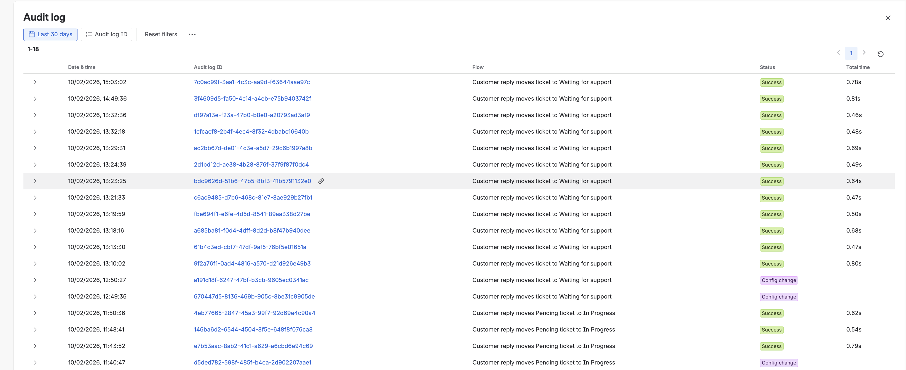

The rule as it should be is in [evidence/24](evidence/24-automation-v2-waiting-for-support.png).

## The fault

I changed box 2 from *Waiting for customer* to **Pending** and saved it. This simulates a colleague "tidying up" a rule without testing it. The audit log recorded it as a **Config change at 21:27:39**.

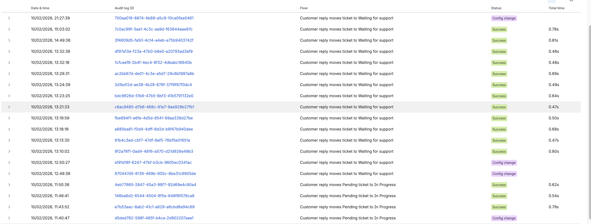

## Timeline

| Time | What happened |
|---|---|
| 21:27 | Rule changed (the fault) |
| 21:36 | James raised KSD-6, "Second monitor not working" |
| 21:38 | I assigned it and asked him about the power light and cable |
| 21:40 | I set it to **Waiting for customer** (Ask customer) |
| 21:42 | **James replied. The ticket didn't move** |
| 21:43–21:53 | Investigation (below) |
| ~21:54 | Rule fixed |
| 21:59 | KSD-6 moved back by hand, internal note added at 22:00 |
| 22:01 | Fix verified with a new reply |

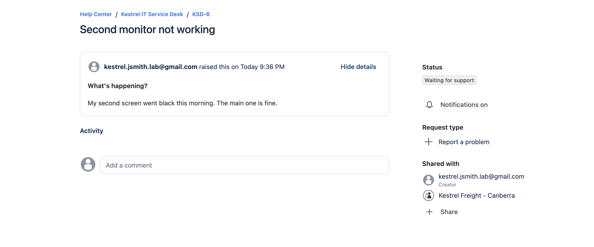
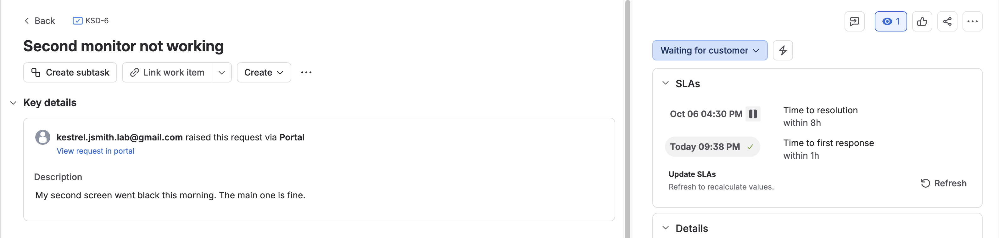

## Symptoms

James replied at 21:42, and the ticket stayed in Waiting for customer. On KSD-4, the line *"Automation for Jira changed the Status"* appeared straight after the customer's comment. On KSD-6 it didn't.

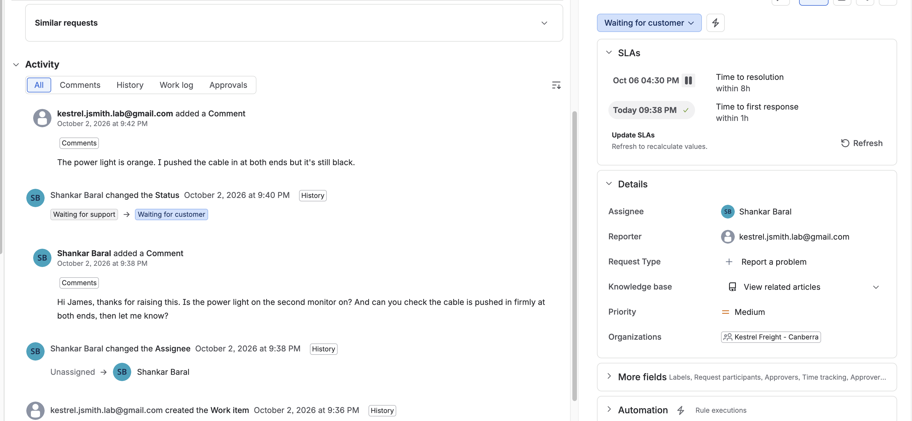

No error email arrived. "Notify on error" only fires when a rule **fails**, and this one didn't fail.

## Investigation

Each check ruled something out:

| Check | Result | Rules out |
|---|---|---|
| Activity on KSD-6 | James's reply is there, at 21:42 | The reply never got posted |
| Ticket's **Automation** panel | The rule ran twice (my reply and James's reply), both with a green tick | The rule being disabled, or the trigger not firing |
| Audit log for the 21:42 run | It stopped after **Work item fields condition**: *"The following issues did not match the condition: KSD-6"*. The "is it the reporter" check and the transition never ran | The reporter check |
| The same audit entry | At trigger time KSD-6 **was** in Waiting for customer | The ticket being in the wrong status |
| The rule itself | Box 2 said **If status equals Pending** | |
| Audit log, Config changes | Changed at 21:27, 15 minutes before the first failed reply. The previous change was at 12:50 | |

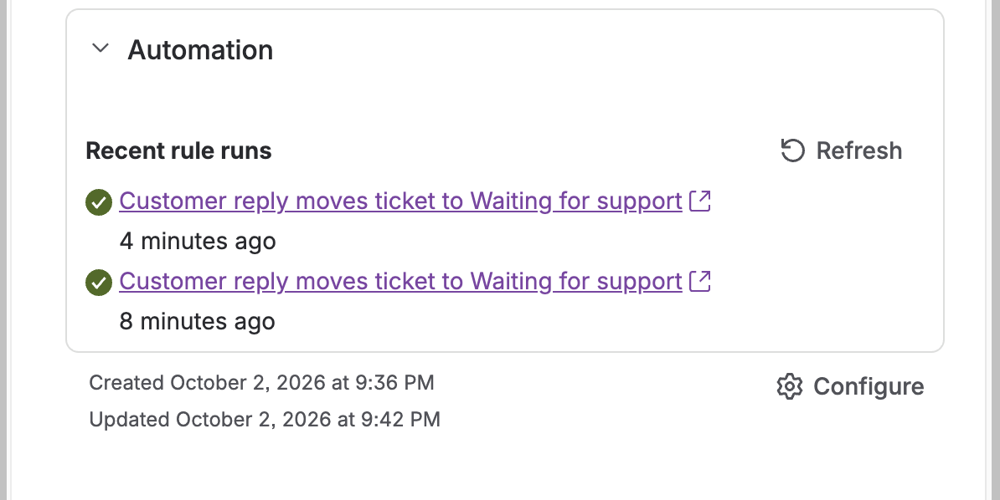
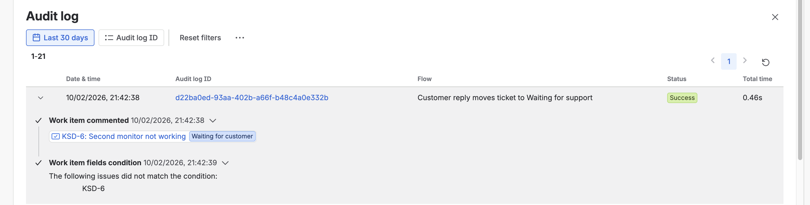
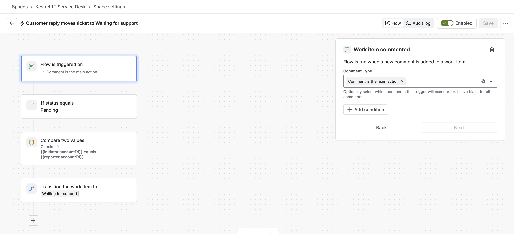

The thing that nearly misled me: **every run said Success.** In Jira automation, Success means the rule ran without crashing, not that it did anything. The proof was in the steps that were **missing** from the run.

## Cause

The rule's status condition had been changed from *Waiting for customer* to *Pending*. Customer replies always arrive on tickets in Waiting for customer, so from 21:27 the rule rejected every one of them, quietly.

## Fix

Set box 2 back to **Waiting for customer** and saved it. Save went grey, so there were no unsaved changes left.

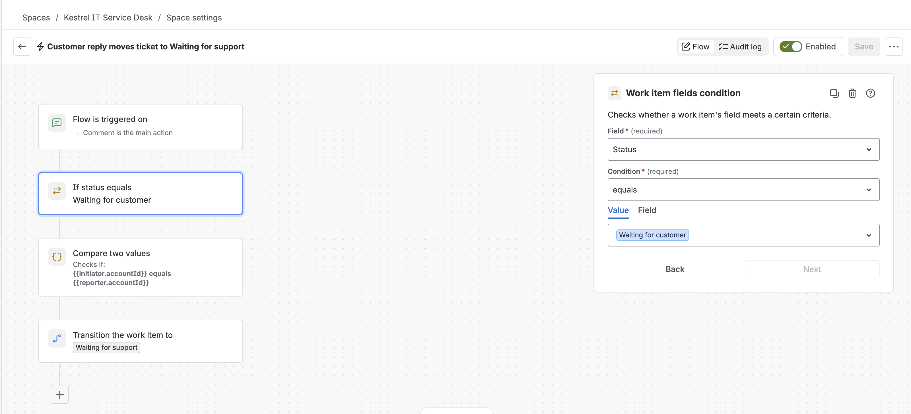

## Cleaning up the damage

Fixing the rule didn't move KSD-6. Automation reacts at the moment a comment is added and never looks back, so James's 21:42 reply was already missed.

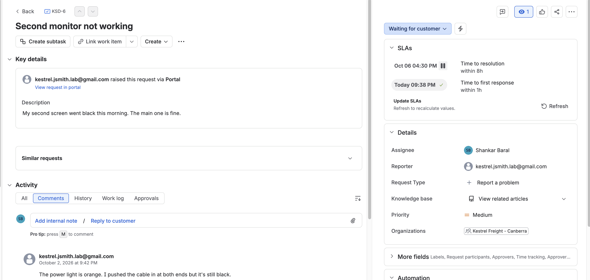

To find every ticket caught by the fault, I searched for everything sitting in Waiting for customer:

```
project = KSD AND status = "Waiting for customer" ORDER BY updated DESC
```

One result: KSD-6. I moved it back with **Customer replied** and added an internal note explaining why, so the next person to open it isn't confused by a manual status change.

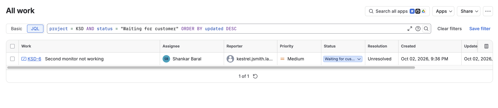
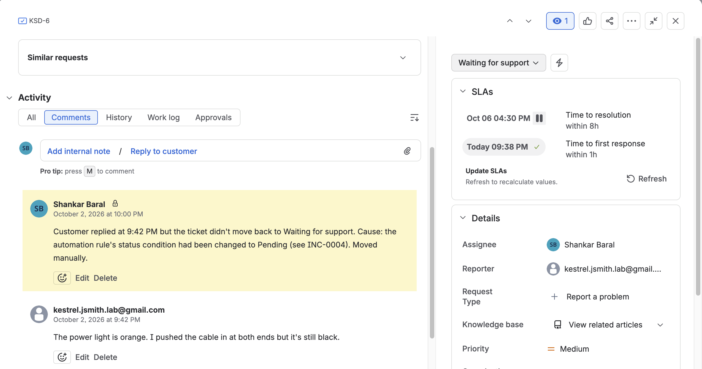

## Verification

I asked James another question (Waiting for customer), and he replied from the portal. Within the same minute, History shows **Automation for Jira** moving it to Waiting for support.

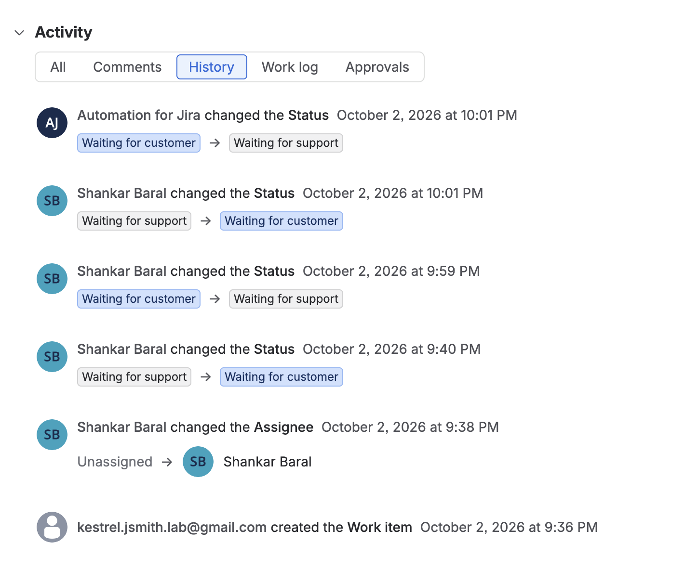

## Impact

- 1 ticket, KSD-6, for about 17 minutes (reply at 21:42, moved by hand at 21:59).
- No SLA effect this time: it all happened after hours, when the clocks don't run anyway.
- **During business hours it would have been worse than a breach.** The resolution clock is paused in Waiting for customer, so the ticket would never have shown up in *About to breach*. The report would say we were within target while the customer waited.

## Prevention

- **Treat automation edits as changes.** A rule edit changes how every ticket is handled. Log it like CHG-0001, and run one test ticket straight after saving.
- **Check "what changed?" first.** The audit log keeps Config changes next to the runs. It found the cause in seconds.
- **Ideas, not built yet:** a daily look at everything in Waiting for customer, or a rule that reminds the customer (and eventually closes the ticket) after a few days with no reply. Either one would make a stuck ticket visible.

## What I learned

- A green tick means "ran", not "worked". Look at which steps actually ran.
- When a rule stops at a condition, everything after it is skipped, and there's no error.
- Fixing the cause stops new damage. It doesn't repair what already happened, so search for the affected tickets.
- Check the simple thing first (was the reply really posted?) before blaming the automation.
