# F2 · Domain controller and first accounts

**Started:** 1 Oct 2026
**Finished:** 2 Oct 2026
**Status:** Complete. Built, tested, break/fix done, runbook written and every section tested on a real ticket. Open items are under "Known issues".

## The request

> **REQ-0002** · From: Megan Doyle, Operations Manager, Kestrel Freight (fictional)
>
> Everyone at head office logs into their PC with their own local account, and when someone leaves we have no idea which PCs they could get into. I want one login per person that works on any office PC, and one place to switch it off when they leave. Sydney staff will need the same thing next year.

That's Active Directory. One server (the domain controller) holds every user account, and every PC checks logins against it. Disable someone there and they're locked out of everything at once.

## What I built

| What | Details |
|------|---------|
| Server | `vm-kestrel-dc01`, Windows Server 2022 Datacenter, size Standard_D2als_v6, Australia Southeast |
| Network | `snet-servers` (10.10.1.0/24), private IP **10.10.1.4** fixed in Azure |
| Domain | `kestrel.local`, new forest, functional level Windows Server 2016 |
| Roles | AD DS, DNS, Global Catalog |
| Admin account | `KESTREL\kadmin` |
| OUs | Staff (Canberra, Sydney), Computer_Resources (Workstations, Servers), Groups |
| Test user | James Smith (`jsmith`) in Staff › Canberra |

## How I did it

### 1. Creating the VM

Azure estimated about $160 a month for this VM if it runs 24/7. That's way over my A$50 budget, so it only runs while I'm working on it and gets shut down after every session.

It goes in `snet-servers`. No NSG on the network card itself, because the NSG from F0 is already attached to the whole subnet.

### 2. Fixing the server's IP

A domain controller is also the DNS server for the office, so every PC needs to find it at the same address forever. By default Azure gives out IPs dynamically, so I changed the network card's private IP from Dynamic to **Static, 10.10.1.4** (the first usable address in the subnet, as planned in the [IP plan](../../docs/standards/ip-plan.md)).

### 3. First login and installing AD DS

RDP in from home (only my IP is allowed, from F0's NSG rule).

Then **Add Roles and Features → Active Directory Domain Services**. Installing the role only puts the software on. The server isn't a domain controller yet, which is why Server Manager shows the warning flag asking to promote it.

### 4. Promoting it to a domain controller

New forest, domain name `kestrel.local`. Kept DNS server and Global Catalog ticked. On a first DC you want both, because PCs find the domain through DNS and the Global Catalog is what logins search.

The DSRM password is a separate emergency password for repairing AD if it ever breaks. It's not the admin password.

The warning about "Windows NT 4.0 cryptography" is normal. It's telling you the DC blocks old weak encryption by default.

### 5. Checking it worked

After the restart, I log in as a domain account now, not a local one:

DNS showed one warning, event 4013. That's normal on a brand new DC's first boot: DNS starts before AD has finished loading and waits for it.

`nslookup` finds the DC at 10.10.1.4. `dsquery domain` failed because "domain" isn't a type dsquery knows. `dsquery ou` worked and showed the only OU so far: Domain Controllers.

### 6. OUs

A new domain only has the built-in folders. I made OUs for Kestrel's layout: staff by site, computers by type, and one place for groups.

I couldn't call the OU "Computers" because there's already a built-in **container** with that name. The built-in Users and Computers folders are containers, not OUs, so you can't link Group Policy to them. That's the reason for making my own.

### 7. First user, with PowerShell

(Password blacked out.) Typing a password in plain text in a command isn't great, since it stays in the PowerShell history. For real accounts I'd use `Read-Host -AsSecureString` and tick "change password at next logon".

## Testing

| Check | Result |
|-------|--------|
| Server is a DC for `kestrel.local` | ✅ Pass (screenshots 12–14) |
| AD DS and DNS roles running | ✅ Pass (13) |
| `nslookup` resolves the DC to 10.10.1.4 | ✅ Pass (17, 24) |
| OUs created in the planned layout | ✅ Pass (19) |
| `jsmith` created in Staff › Canberra | ✅ Pass (21) |
| `jsmith` can actually log in from a domain PC | Not tested. There's no client PC until the Windows client lab |
| Lockout policy works (10 attempts → locked) | ✅ Pass (36, 37) |
| Unlock, password reset, disable/enable | ✅ Pass (42, 43, 46) |
| DC health: AD, DNS, Netlogon, Kerberos running; dcdiag clean | ✅ Pass (47, 48) |
| RDP blocked from anywhere except my IP | Still not tested (carried over from F0) |

## Break/fix 🔧

Planned fault: the DC could resolve internal names but not internet names ("Windows Update failing, can't reach microsoft.com"). I took a baseline, made the fault, then worked it like a real ticket: reproduce, rule things out layer by layer, prove the cause against the baseline, fix, verify.

Full write-up: [incident-02-dc-cant-resolve-internet-names.md](incident-02-dc-cant-resolve-internet-names.md)

## Runbook 📘

Day-to-day tasks for the service desk (new starter, password reset, unlock, leaver, account checks), plus DNS troubleshooting and what to do if you can't RDP in: [runbook.md](runbook.md). Every section has been tested; see the next section.

## Proving the runbook on a real ticket (KSD-5) 🔒

Most of the runbook was written but not tested. Instead of running the commands one by one, I worked a proper lockout ticket from start to finish and tested each procedure as the ticket needed it.

### Linking Jira and AD

The first test tickets came from a real person's Gmail, which didn't match any AD account. I made a dedicated lab inbox for James Smith, added it to Jira as a customer, and put the same address on his AD account. Now the service desk and AD are linked by email, the way they would be at a real company.

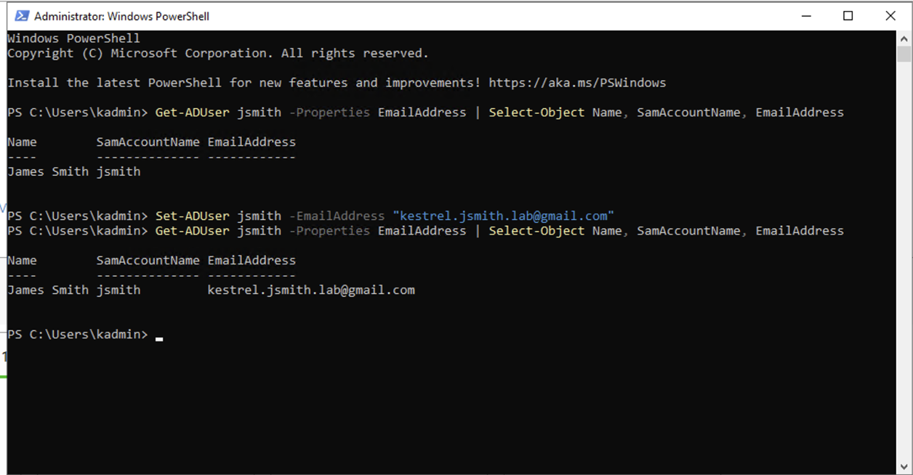

### The domain couldn't lock anyone out

Before testing an unlock, I checked the lockout policy. **LockoutThreshold was 0**, which means never lock, no matter how many wrong passwords. That's the default on a new domain. So a "locked out" ticket here would really have been a wrong or expired password.

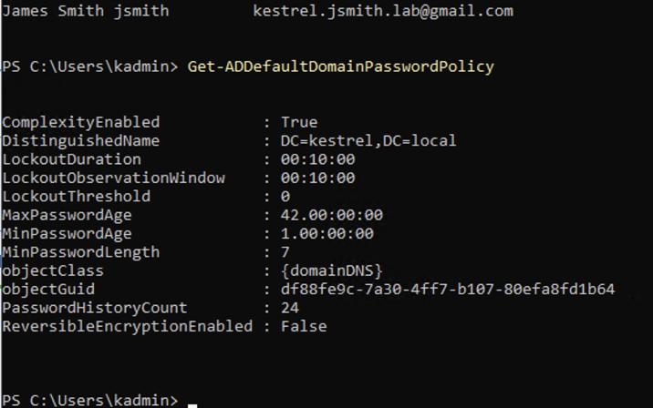

I set it in the **Default Domain Policy** GPO, not with PowerShell. The GPO is the master copy and already defined the threshold as 0, so a PowerShell change would have been put back at the next policy refresh. Windows suggested 10 attempts, 10 minutes and 10 minutes, and I kept its suggestions.

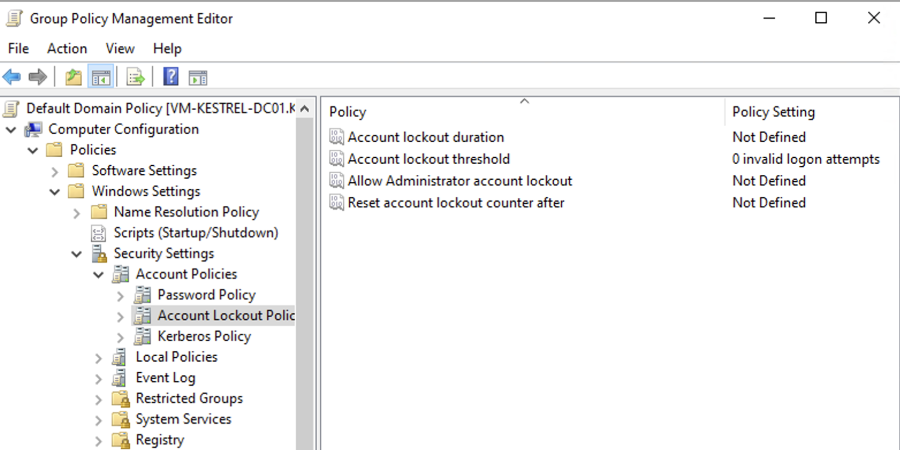
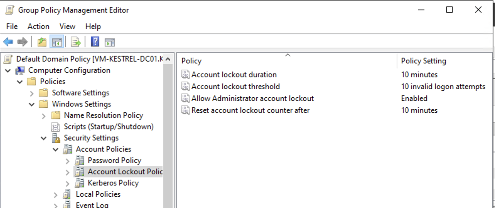
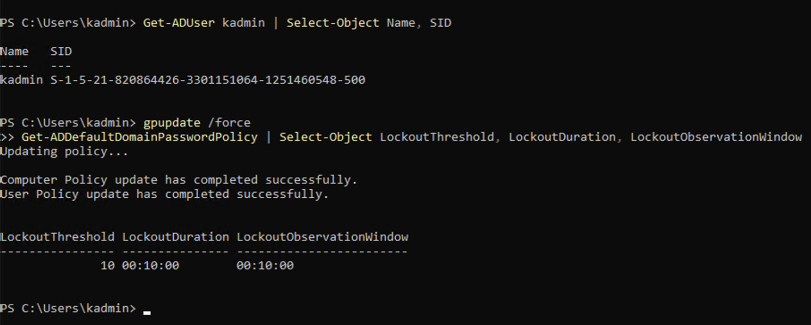

Something I found along the way: `kadmin` has a SID ending in **-500**, so it's the domain's built-in Administrator, just renamed by Azure. "Allow Administrator account lockout" is now on, so 10 bad RDP passwords would lock me out too.

### Making a real lockout

Baseline first (not locked, 0 bad passwords). Then I tried to RDP to the DC as `KESTREL\jsmith` from my Mac with 10 wrong passwords. Staff can't log on to a DC anyway, but the password is checked before that, so every wrong one counted.

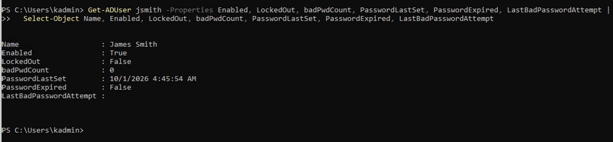
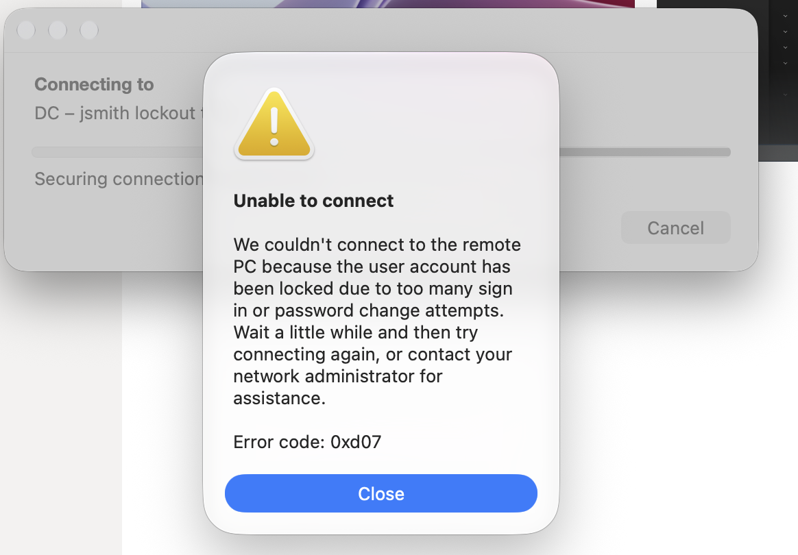
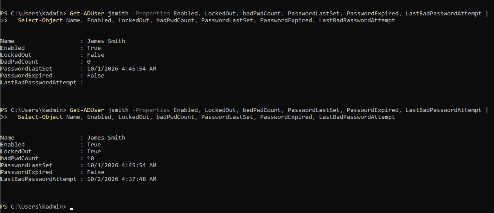

### Finding where the bad passwords came from

Event **4740** (account locked out) said *who* and *when*, but the "Caller Computer Name" was blank. That's common when the attempts come from a Mac or over RDP from the internet. Event **4625** (failed logon) had the answer: 10 attempts, about 4 seconds apart, all from one IP (mine, blacked out), logon type 3. On a company network that IP would lead to the device.

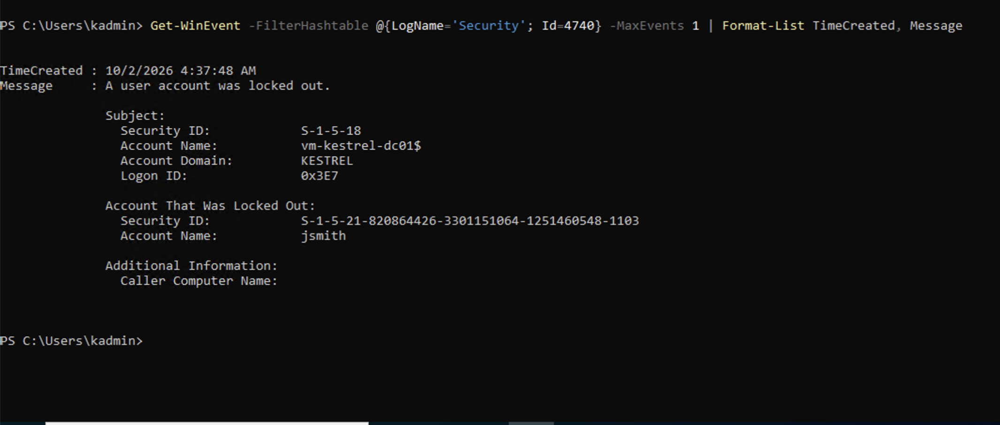
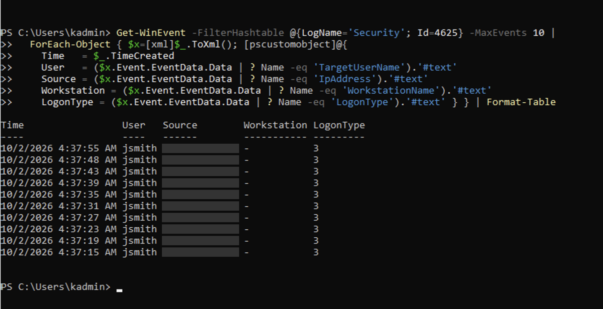

The server clock was on UTC (Azure's default), so the event times were 10 hours off from Jira. I changed the server's time zone to Canberra. That only changes how times are *shown*; Windows still stores everything in UTC.

### The ticket

James raised **KSD-5** from his own account. The older KSD-2 (raised from the wrong account) was linked and closed as a **Duplicate**.

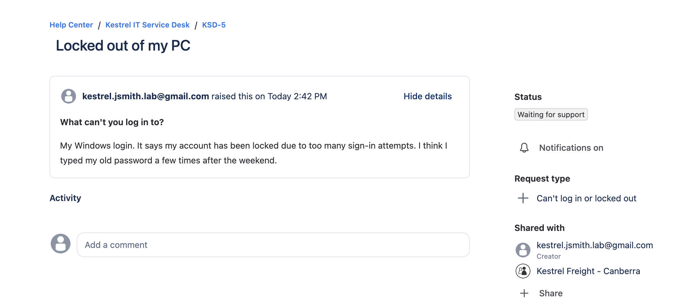

By the time I checked, the 10 minutes had passed and he'd unlocked himself. `LockedOut` was False, but the lockout time and `badPwdCount 10` were still showing. So **a lockout time on its own doesn't mean someone is still locked**. Always read `LockedOut`.

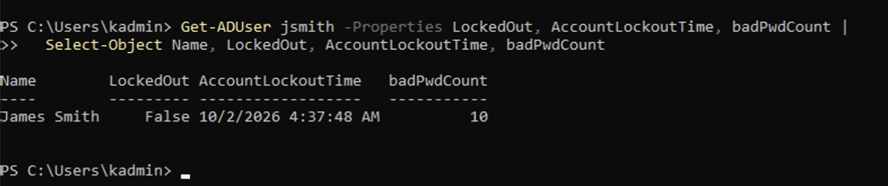

I locked him again and unlocked him by hand. A manual unlock clears everything: LockedOut False, badPwdCount 0, and no lockout time.

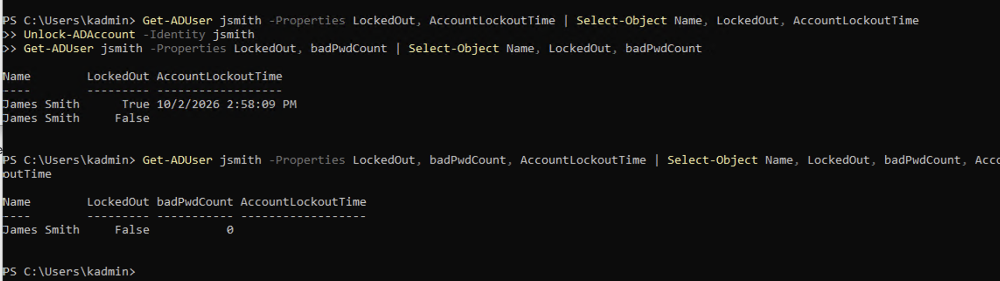

He wasn't sure which password was current, so I reset it to a temporary one (typed with `Read-Host -AsSecureString` so it isn't on screen or in history) and ticked "must change at next logon". Trying it over RDP proved both: the password was right, and Windows wanted it changed.

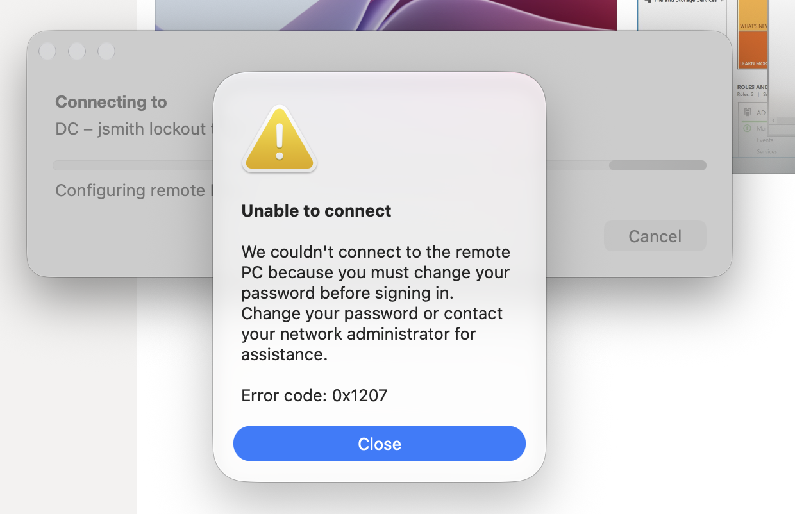
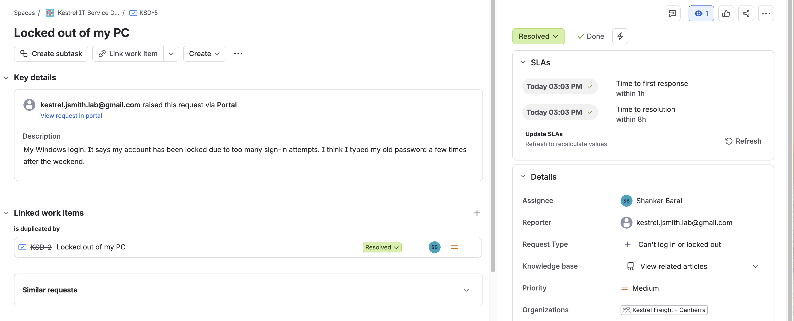

KSD-5 was resolved in 21 minutes. Both SLAs stopped at the same moment, because I didn't send James a quick "I'm on it" reply first. Next time: assign, acknowledge, *then* work it.

### Leaver test and health check

I recorded his groups, disabled him (Enabled False), then re-enabled him, since he's the only test user. I also compared him with kadmin, who's in every top admin group.

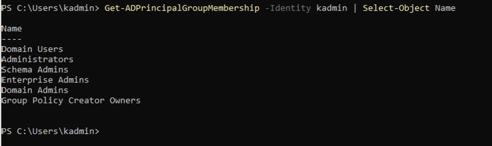
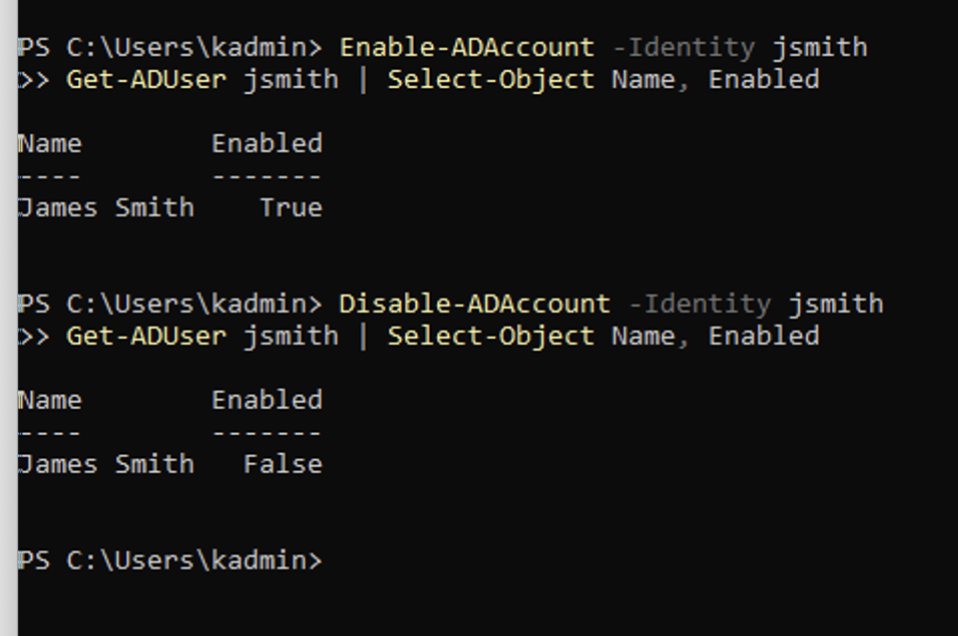
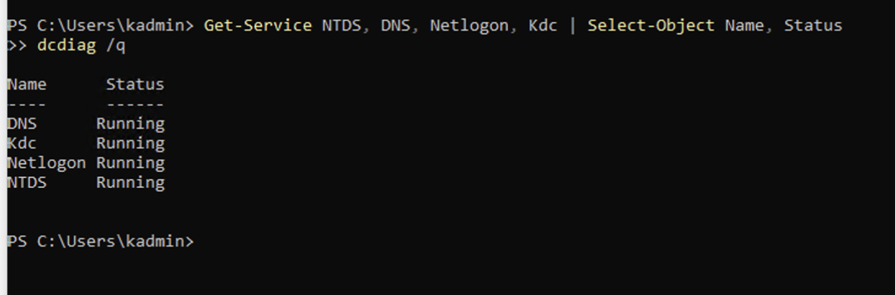
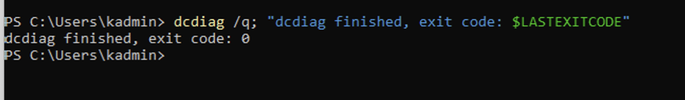

## Things that went wrong 😅

**1. I locked myself out of the server.** While setting the static IP inside Windows (on top of the static IP already set in Azure), the server dropped to an APIPA address (169.254.x.x) and I lost RDP. I got back in through Azure's **Serial Console**, a text console in the portal that works even when the network is broken, and fixed the IP settings from there.

I didn't screenshot the broken state, only the result afterwards, and I didn't confirm the cause in the event logs. APIPA means Windows had no valid IP at all. It usually comes from either DHCP not answering or Windows detecting an IP conflict. It wasn't DNS: RDP connects straight to the IP, and the server wasn't even a DC yet at that point.

Lesson: in Azure the IP only *needs* to be set on the Azure network card. Windows can stay on DHCP and Azure always hands it the same reserved address. Setting it in Windows too is how you'd do it on a physical server.

**2. DNS pointed at itself in a confusing way.** After promotion, the DNS servers were `::1` and `127.0.0.1`, which are both "this computer" (IPv6 and IPv4). The promotion wizard sets that.

I changed IPv4 to 10.10.1.4, but `::1` was still listed first:

That's because IPv4 and IPv6 have **separate** DNS settings, so the IPv4 command can't touch the IPv6 entry. The fix was the IPv6 command:

`nslookup` still says `Server: UnKnown`. That's a different thing. nslookup tries to look up a name for the DNS server's own IP, and there's no reverse lookup zone yet. That gets built in the DNS lab (F5).

## Known issues / still to do

- **IP is set in two places.** 10.10.1.4 is set in Azure *and* in Windows. They match, so it works, but if one ever changes and the other doesn't, the server drops off the network. Microsoft's advice for Azure is to set it in Azure only. Leaving it for now and keeping them in sync.
- **`.local` domain name.** Microsoft recommends a subdomain of a real domain (like `ad.kestrelfreight.com.au`). `.local` also clashes with how Macs find devices on the network, which will matter in the Mac lab. Keeping it for now and noting it here.
- **Firewall profile shows "Private".** On a DC it should be "Domain". Need to check this.
- **The DC has a public IP.** OK for a lab because RDP only accepts my IP, but a real DC would never face the internet.
- **Daily admin uses the built-in Administrator** (`kadmin`, RID 500), which is in every top admin group (Domain, Enterprise and Schema Admins). Planned: a separate named admin account, and emptying Enterprise/Schema Admins (admin access lab).
- **No client PC yet.** The lockout was made with RDP attempts against the DC, and James couldn't actually change his password (the DC refuses staff logons). A domain-joined PC comes in the Windows client lab.
- **jsmith still has "must change password at next logon" set**, from the reset test.

## Cost

Only runs during lab sessions and gets shut down after. Actual cost to be added from Cost Management.

## Handover

For whoever looks after the DC next:

- **Server:** `vm-kestrel-dc01`, 10.10.1.4, domain `kestrel.local`. Shut down (deallocated) between sessions to save money.
- **Admin:** `KESTREL\kadmin` is the built-in Administrator (RID 500) and is in every top admin group. 10 wrong passwords locks it for 10 minutes. If that happens, wait it out or use the Serial Console.
- **Lockout policy:** 10 attempts, 10 minutes, set in the Default Domain Policy. Change it there, not with PowerShell.
- **Test user:** `jsmith` (James Smith, Staff › Canberra), email `kestrel.jsmith.lab@gmail.com`, linked to the same Jira customer. Enabled, with a temporary password and "must change at next logon" set.
- **DNS forwarder:** 8.8.8.8 with root hints on. That's the known-good baseline from INC-0002.
- **Server time zone:** Canberra.
- **Day-to-day tasks:** [runbook.md](runbook.md). Every section has now been tested.
- **Open items:** see "Known issues" above.

## Retro

**What went well**
- Working a real ticket (KSD-5) to test the runbook was much better than running commands on their own. Every step had a reason.
- Checking before changing: the account state before unlocking, the policy before assuming a lockout was possible, a baseline before the DNS break/fix. It caught the threshold-0 problem straight away.
- The break/fix (INC-0002) was proven against a baseline, not guessed.

**What I'd do differently**
- Set the static IP in Azure only and leave Windows on DHCP. Setting it in both places is what I was doing when I lost RDP.
- Choose a proper domain name (like `ad.kestrelfreight.com.au`) instead of `.local`, and set the server's time zone on day one.
- Use a dedicated admin account from the start, not the built-in Administrator.
- Send the customer a quick acknowledgement before working a ticket, so first response actually measures response time.

**What I learned**
- GPOs are the master copy. Change domain settings at the source.
- Lockouts are counted per account on the DC, from any device.
- 4740 tells you who got locked out and when; 4625 tells you where from.
- Self-unlock vs manual unlock leave the account looking different.
- When PowerShell runs several commands together, the first one decides the table columns, so check results on their own.

