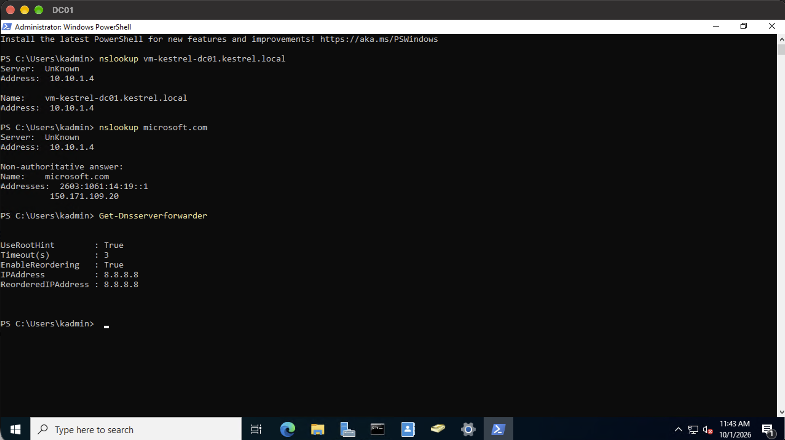
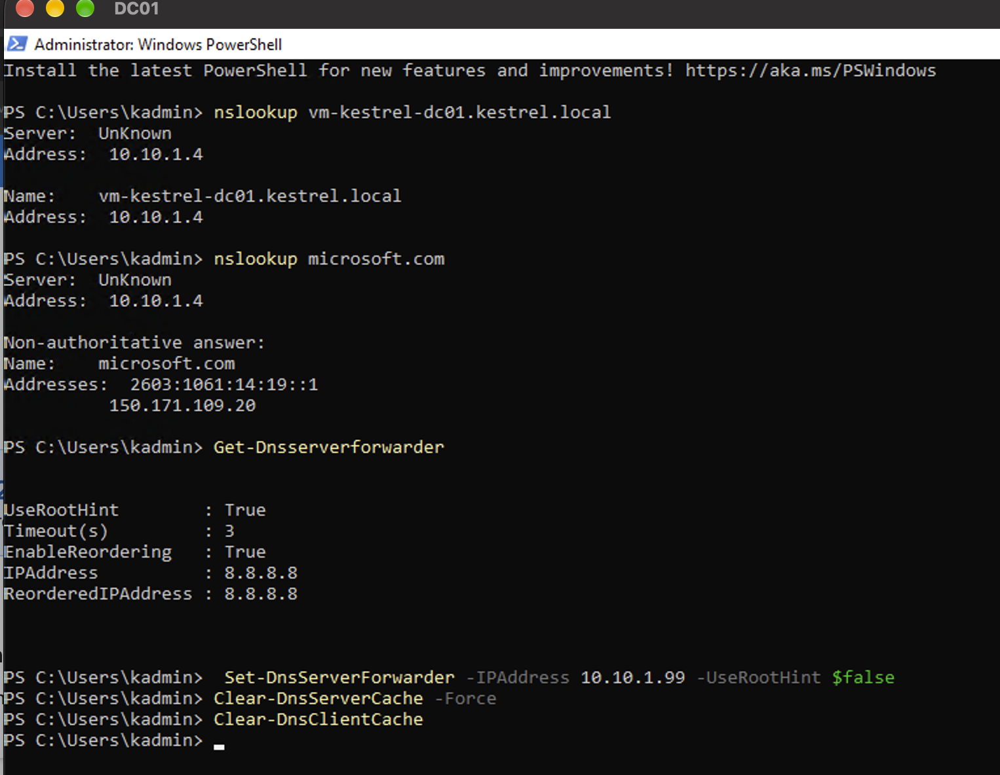
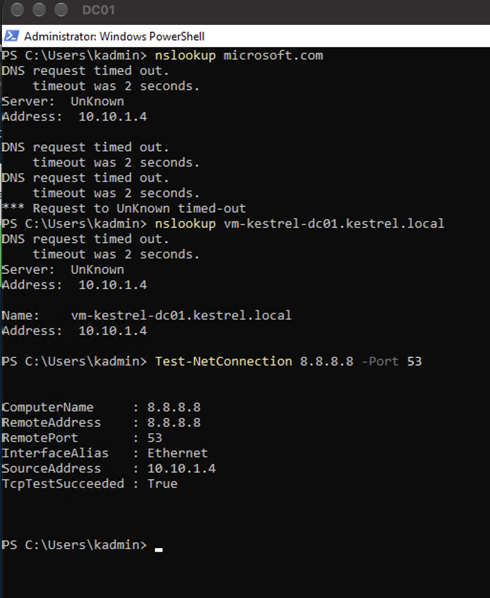
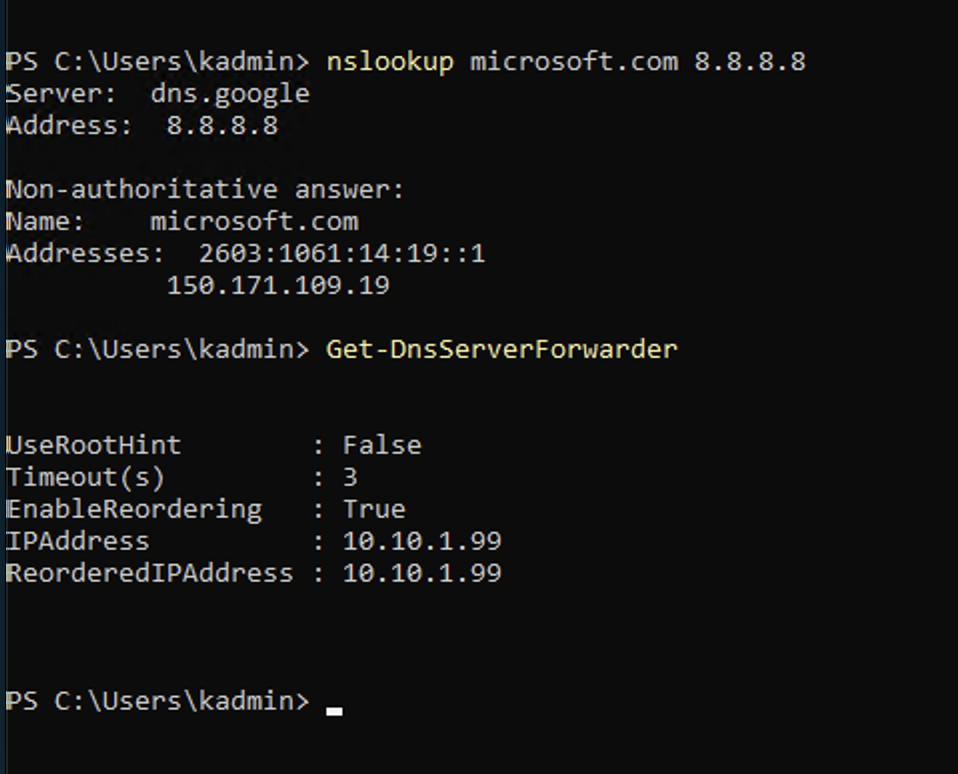
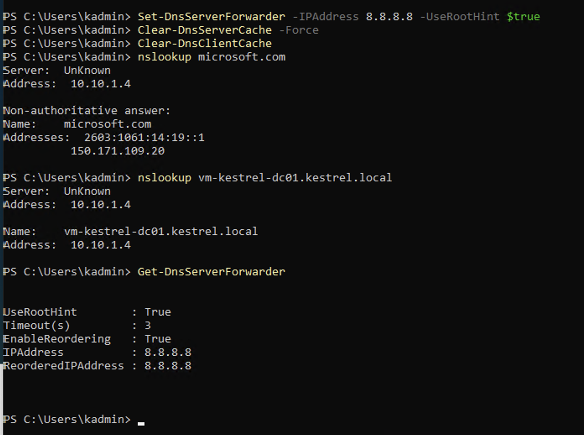

# INC-0002 · DC can't resolve internet names

| | |
|---|---|
| **Date** | 1 Oct 2026 |
| **Raised by** | Tom Nguyen, Service Desk (fictional) |
| **Affected** | `vm-kestrel-dc01` (DNS server for kestrel.local) |
| **Status** | Resolved |
| **Type** | Planned break/fix exercise. I made the fault on purpose, then worked it like a real ticket |

## The ticket

> Windows Update on the domain controller has been failing since this afternoon with a "can't connect to the update service" error. I also tried opening microsoft.com in Edge on the server and got "Hmm, we can't reach this page". Staff logins are fine and nobody's complained about anything else.

## Baseline (before the fault)

Captured the working state first, so I'd have something to compare against:



- Internal name resolves (10.10.1.4)
- `microsoft.com` resolves
- Forwarder: **8.8.8.8**, root hints **on**

## Making the fault

Pointed the DC's forwarder at 10.10.1.99 (an address where nothing exists), turned off root hints, and cleared the caches so the fault would show straight away:



## Symptoms



| Test | Result |
|------|--------|
| `nslookup microsoft.com` | Timed out |
| `nslookup vm-kestrel-dc01.kestrel.local` | Worked (10.10.1.4) |
| `Test-NetConnection 8.8.8.8 -Port 53` | `TcpTestSucceeded: True` |

## Investigation

**1. Rule things out.** The internal lookup worked, so the DNS service was running. The server could reach 8.8.8.8 on port 53, so the network, NSG and firewall were fine. That left one thing: how the DC answers questions about names it doesn't own.

One thing confused me at first: the *internal* lookup also showed a "DNS request timed out" before answering. That's nslookup trying to find a name for the DNS server's own IP before every query. There's no reverse zone yet, so the DC tries to ask the internet, and that was broken too. Same fault, second symptom.

**2. Prove it.**



- `nslookup microsoft.com 8.8.8.8` (asking Google's DNS directly, skipping the DC) **worked**. So the internet was fine and only lookups going through the DC failed.
- `Get-DnsServerForwarder` showed the forwarder as **10.10.1.99** with root hints **off**. Compared to the baseline, both had changed.

## Cause

The DC's DNS forwarder had been changed to 10.10.1.99, an address where nothing exists, and root hints were turned off. So every internet lookup was sent to a dead address with no backup route, and timed out.

(In this exercise I made that change myself, see "Making the fault" above. In real life this would be a config change that wasn't tested, or someone "tidying up" DNS settings.)

## Fix

Put it back to the known-good baseline, then cleared the caches so I was testing fresh lookups and not old failed ones:

```powershell
Set-DnsServerForwarder -IPAddress 8.8.8.8 -UseRootHint $true
Clear-DnsServerCache -Force
Clear-DnsClientCache
```

I only restored the baseline. Switching to Azure's own DNS (168.63.129.16) might be a better setup, but changing something extra in the middle of an incident is how you end up with two problems. That's a separate planned change.

## Verification



| Check | Result |
|-------|--------|
| `microsoft.com` resolves | ✅ Pass |
| Internal name resolves, no timeout line before it | ✅ Pass |
| Forwarder 8.8.8.8, root hints on (matches baseline) | ✅ Pass |
| Windows Update connects | Not tested |

## Prevention

- **Take a baseline before changing DNS settings.** Comparing against it is what made this quick to prove.
- **Don't turn off root hints unless there's a reason.** With them on, a dead forwarder makes lookups slow, but they don't fail completely.
- **Monitoring.** An alert on external name lookups failing from the DC would catch this before a user does. That's for the monitoring lab.

## What I learned

- Work the ticket in layers: is the service up, is the network up, then what's left. Each test should rule something out.
- `nslookup name server` lets you skip a DNS server and ask a different one directly. That's the quickest way to prove which one is broken.
- "Server: UnKnown" and the extra timeout line are about the *reverse* lookup of the DNS server, not the name you asked for.
