# INC-0005 · New starter has no network drives

| | |
|---|---|
| **Date** | 9 Oct 2026 |
| **Ticket** | KSD-8, raised by Priya Sharma (Finance Manager) |
| **Affected** | 1 user, Daniel Lee (`dlee`), Finance |
| **Priority** | High (a new starter can't reach the files he needs for Monday's pay run) |
| **Status** | Resolved |
| **Type** | Planned break/fix exercise. I made the fault on purpose, in plain sight, then worked it from the symptoms as if a colleague had created the account |

## The fault

I created Daniel the way a rushed admin might: the right groups (GG-Finance, GG-AllStaff), but **no `-Path`**. Without a path, `New-ADUser` puts the account in the built-in **Users** container, not in Staff › Canberra.

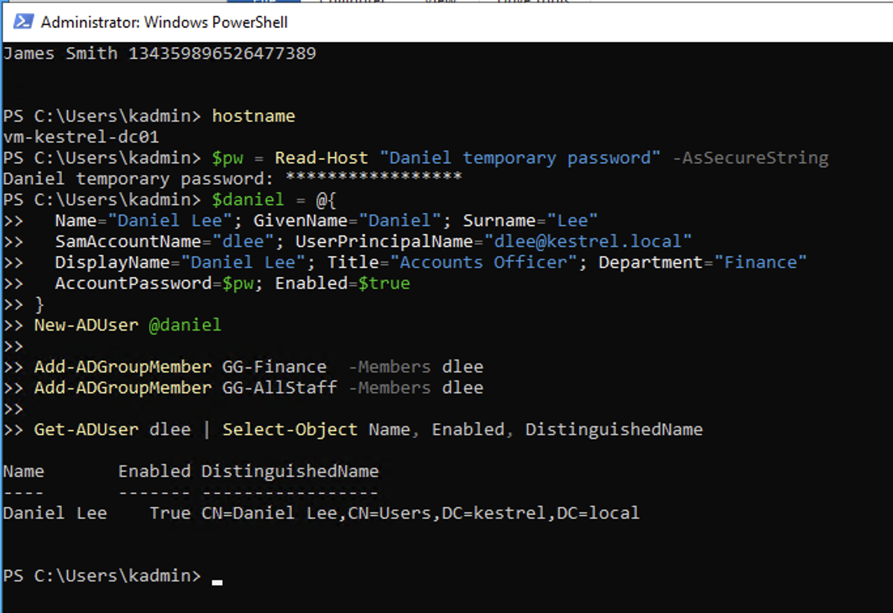

## Symptoms

Daniel could log in to the PC, but This PC showed only C: and the DVD drive. No F: (Finance) and no K: (Company).

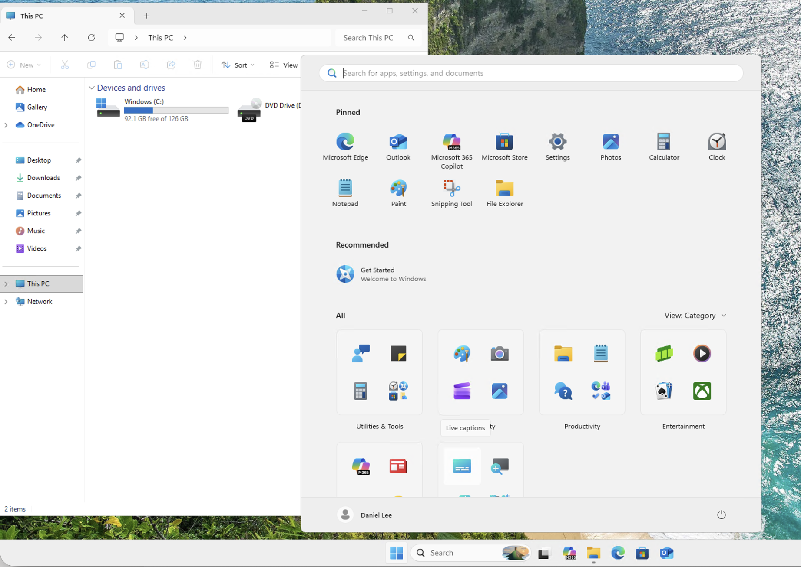

Priya raised KSD-8 at 3:15 PM with that screenshot. It's a *Report a problem* request, so it's an incident with 1h / 8h targets, and I set the priority to High.

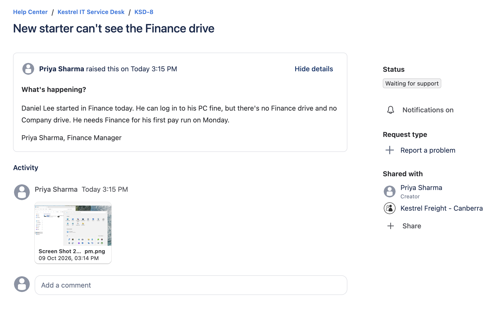
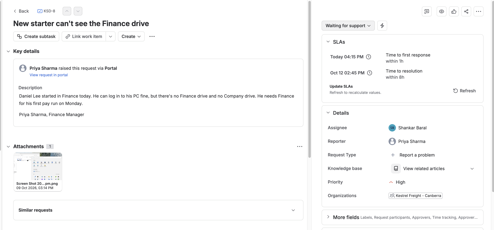

## Timeline

| Time | What happened |
|---|---|
| ~3:08 PM | Daniel's account created (the fault) |
| 3:09 PM | Daniel logs in to the PC, no drives |
| 3:15 PM | Priya raises KSD-8 |
| 3:18 PM | First response to Priya |
| 3:19–3:24 PM | Investigation (below) |
| 3:25 PM | Account moved to Staff › Canberra |
| 3:28–3:29 PM | Verified after Daniel logged off and on |
| 3:31 PM | KSD-8 resolved |

## Investigation

**1. Compare him with someone who works.** Priya is also in Finance and gets her drives, so I put the two accounts side by side.

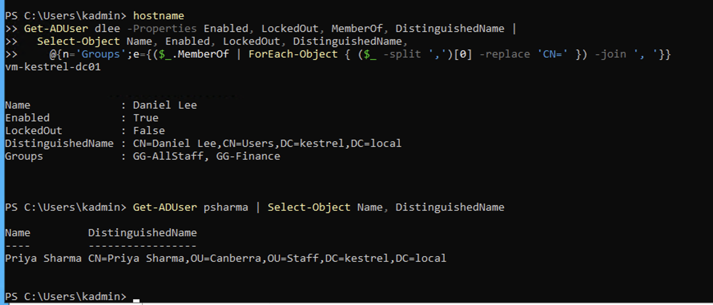

Daniel is enabled, not locked out, and in GG-Finance and GG-AllStaff, so the groups are right. The difference is where the accounts live. Priya is in `OU=Canberra,OU=Staff`. Daniel is in `CN=Users`.

**2. What does Group Policy say?** `gpresult /r /scope user`, logged in as Daniel:

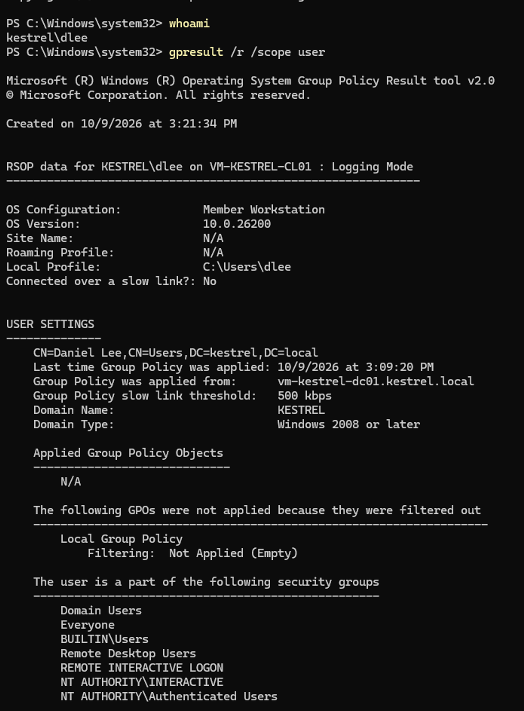

**Applied Group Policy Objects: N/A.** The drive map GPO wasn't filtered out or failing. It never reached him at all. His groups were all there, including DL-Finance-Modify:

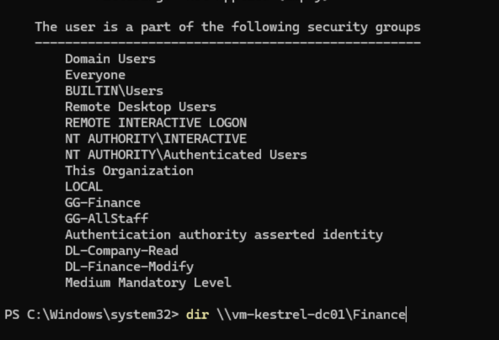

**3. Are the permissions fine?** If permissions were the problem, the drives wouldn't help anyway. I opened the share directly by its path:

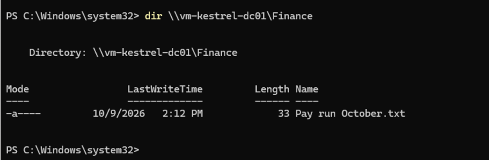

It worked and listed the pay run file. So the permissions were fine, and only the drive mapping was missing.

**Why could he log in at all?** The RDP GPO is a *computer* policy, linked to the Workstations OU where the PC sits. It adds GG-AllStaff to the PC's Remote Desktop Users group, and Daniel is in GG-AllStaff. The drive map GPO is a *user* policy linked to Staff, and Daniel wasn't in Staff.

## Cause

Daniel's account was in the built-in **Users** container. The drive map GPO is linked to the **Staff** OU, and containers like Users can't have GPOs linked to them at all. So no user policy reached him, even though his groups and permissions were correct.

## Fix

```powershell
Get-ADUser dlee | Move-ADObject -TargetPath "OU=Canberra,OU=Staff,DC=kestrel,DC=local"
```

My first try was in the wrong window. I ran it on the client PC, which doesn't have the AD PowerShell module, so it just errored. `hostname` showed `vm-kestrel-cl01`.

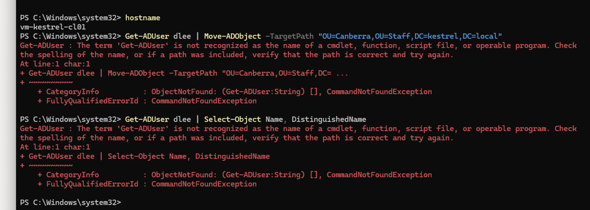

Ran it again on the DC:

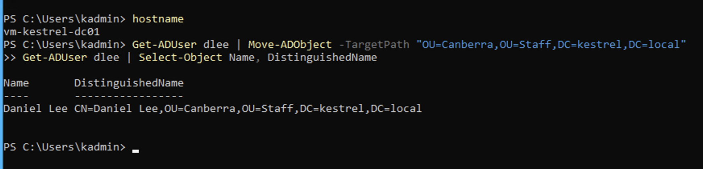

## Verification

Daniel logged off and back on (Group Policy and group membership are read at logon).

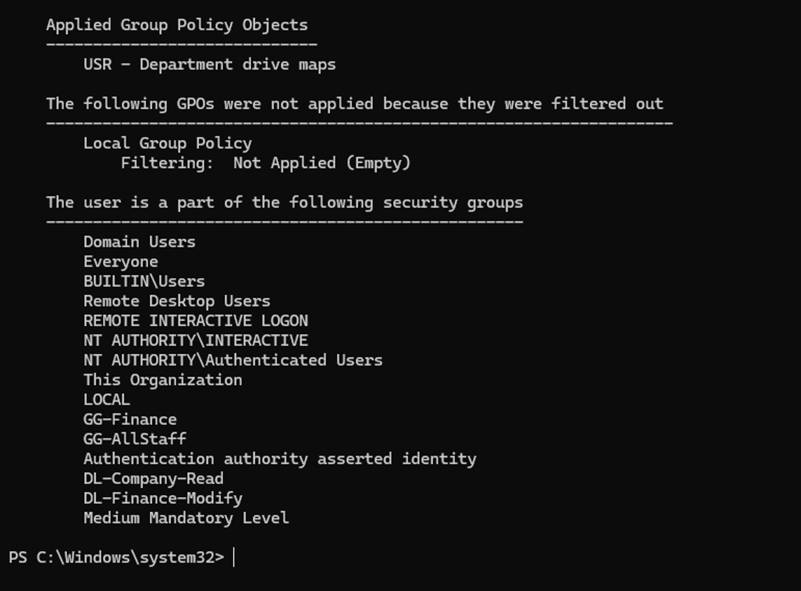
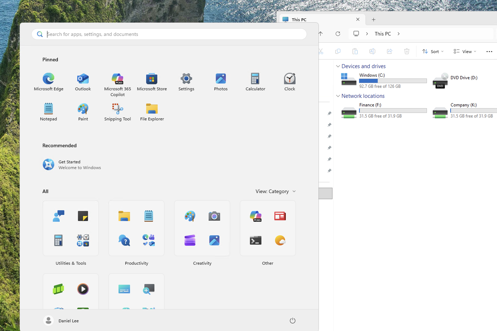

The drive map GPO now shows as applied, and This PC has Finance (F:) and Company (K:). KSD-8 was resolved at 3:31 PM. First response 3:18, resolution 3:31, both met.

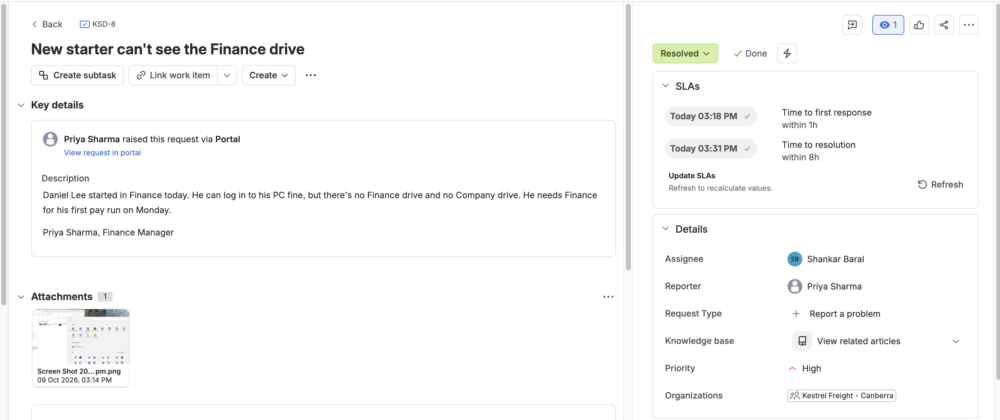

## Impact

- 1 user, from his first login until the fix, about 20 minutes.
- He could still have opened the share by its path, but nobody would know to tell him that.

## Prevention

- **Always give `New-ADUser` a `-Path`.** The joiner process (F4) should take the OU from the CSV, not from memory.
- **Change the default.** `redirusr "OU=New Starters,..."` makes new accounts land in an OU instead of the Users container. That OU could have a GPO of its own. Planned for the Group Policy lab.
- **Check a new account before handing it over:** `Get-ADUser <name>` and read the DistinguishedName.

## What I learned

- Compare a broken user with a working one. It found the difference in two commands.
- "Applied Group Policy Objects: N/A" means the GPO never reached the user. Check *where* the account is before checking the GPO itself.
- Opening the share by its UNC path separates "permissions" from "drive mapping" in one step.
- Run `hostname` first, on its own, and read it.
